# System Architecture Overview

## High-Level System Architecture

```mermaid
graph TB
    subgraph "Frontend Layer"
        UI[React UI Layer]
        R3F[React Three Fiber]
        DREI[Drei Components]
        MOTION[Framer Motion]
    end

    subgraph "State Management"
        ZUSTAND[Zustand Store]
        GAME[Game Store]
        PLAYER[Player Store]
    end

    subgraph "3D Rendering Engine"
        THREE[Three.js Core]
        SHADERS[Custom Shaders]
        GEOMETRY[Sacred Geometry]
        EFFECTS[Post-processing]
    end

    subgraph "Game Engine"
        ENGINE[Game Engine Core]
        AUDIO[Audio Manager]
        PHYSICS[Physics System]
        ENTITIES[Entity System]
    end

    subgraph "Performance Layer"
        MONITORING[Performance Monitor]
        POOLING[Resource Pooling]
        LAZY[Lazy Loading]
        SPLITTING[Code Splitting]
    end

    subgraph "Build System"
        VITE[Vite Build Tool]
        TS[TypeScript]
        BUNDLER[Bundle Optimization]
        TERSER[Minification]
    end

    subgraph "Quality Assurance"
        VITEST[Vitest Testing]
        ESLINT[ESLint Linting]
        HUSKY[Git Hooks]
        COVERAGE[Coverage Reports]
    end

    subgraph "Deployment"
        EXPRESS[Express Server]
        HELMET[Security Headers]
        SERVE[Static Serving]
        PM2[Process Manager]
    end

    UI --> ZUSTAND
    UI --> R3F
    R3F --> THREE
    R3F --> DREI
    UI --> MOTION

    ZUSTAND --> GAME
    ZUSTAND --> PLAYER

    THREE --> SHADERS
    THREE --> GEOMETRY
    THREE --> EFFECTS

    ENGINE --> AUDIO
    ENGINE --> PHYSICS
    ENGINE --> ENTITIES
    ENGINE --> ZUSTAND

    UI --> MONITORING
    MONITORING --> POOLING
    MONITORING --> LAZY

    VITE --> TS
    VITE --> BUNDLER
    VITE --> TERSER
    VITE --> SPLITTING

    VITEST --> COVERAGE
    ESLINT --> HUSKY

    EXPRESS --> HELMET
    EXPRESS --> SERVE
    SERVE --> PM2

    style UI fill:#e1f5fe
    style THREE fill:#f3e5f5
    style ZUSTAND fill:#e8f5e8
    style ENGINE fill:#fff3e0
    style MONITORING fill:#fce4ec
    style VITE fill:#f1f8e9
```

## Technology Stack Summary

### Frontend Technologies
- **React 19.1.1** - Modern UI framework with latest features
- **TypeScript 5.8.3** - Type-safe JavaScript development
- **Vite 7.1.7** - Fast build tool and development server
- **Tailwind CSS 4.1.13** - Utility-first CSS framework

### 3D Graphics Stack
- **Three.js 0.180.0** - WebGL 3D graphics library
- **React Three Fiber 9.3.0** - React renderer for Three.js
- **React Three Drei 10.7.6** - Useful helpers and abstractions
- **React Spring Three 10.0.3** - Spring-physics animations

### State Management
- **Zustand 5.0.8** - Lightweight state management
- **Custom Game Store** - Game-specific state management
- **Player Store** - Player progression and data

### Animation & UI
- **Framer Motion 12.23.22** - Production-ready motion library
- **Heroicons 2.2.0** - Beautiful hand-crafted SVG icons

### Development & Testing
- **Vitest 3.2.4** - Fast unit test framework
- **Testing Library** - Simple and complete testing utilities
- **ESLint 9.36.0** - Code linting and formatting
- **Husky 9.1.7** - Git hooks for quality assurance

### Build & Deployment
- **Express 5.1.0** - Node.js web application framework
- **Helmet 8.1.0** - Security middleware
- **PM2** - Production process manager
- **Terser 5.44.0** - JavaScript minification

## Architecture Principles

### 1. Component-Based Architecture
- Modular React components with clear responsibilities
- Reusable UI components in dedicated directories
- 3D components separated from regular UI components

### 2. Performance-First Design
- Code splitting for optimal bundle sizes
- Resource pooling for 3D objects
- Lazy loading for heavy components
- Performance monitoring throughout

### 3. Type Safety
- Full TypeScript implementation
- Strict type checking
- Interface definitions for all major components

### 4. Scalable State Management
- Zustand for lightweight, scalable state
- Modular stores for different concerns
- Reactive state updates with subscriptions

### 5. Security-Focused
- Content Security Policy implementation
- Secure headers via Helmet
- Input validation and sanitization
- Error boundary protection

## System Boundaries

### Frontend Boundary
- React components and hooks
- Client-side state management
- 3D rendering and animations
- User interaction handling

### Backend Boundary
- Express server for static content
- Security middleware
- Performance optimization
- Asset serving

### External Dependencies
- Three.js ecosystem for 3D graphics
- Animation libraries for UI motion
- Testing frameworks for quality assurance
- Build tools for optimization