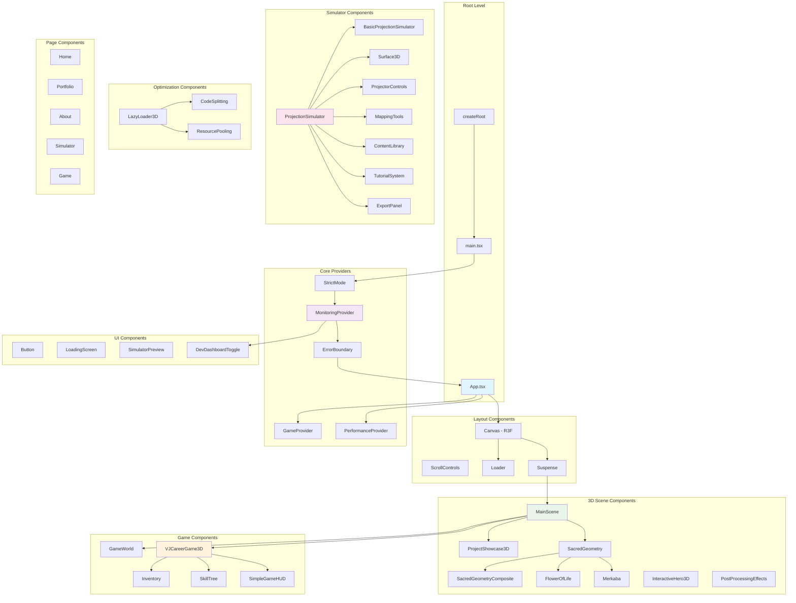
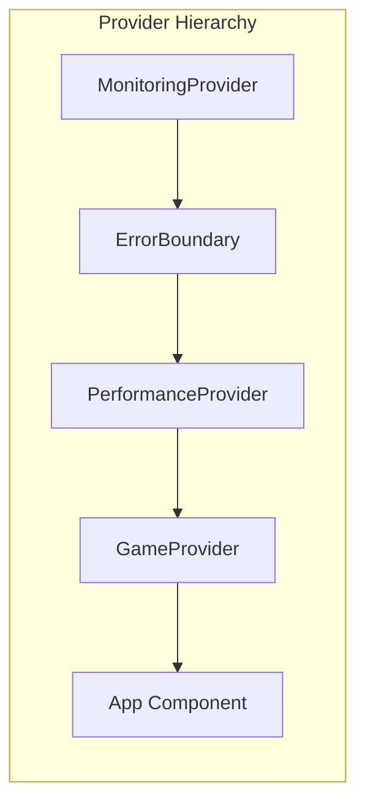
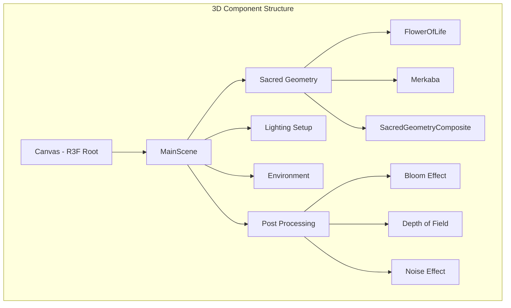
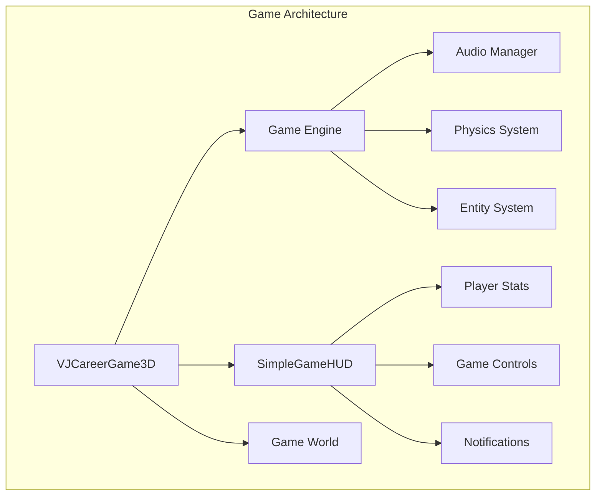
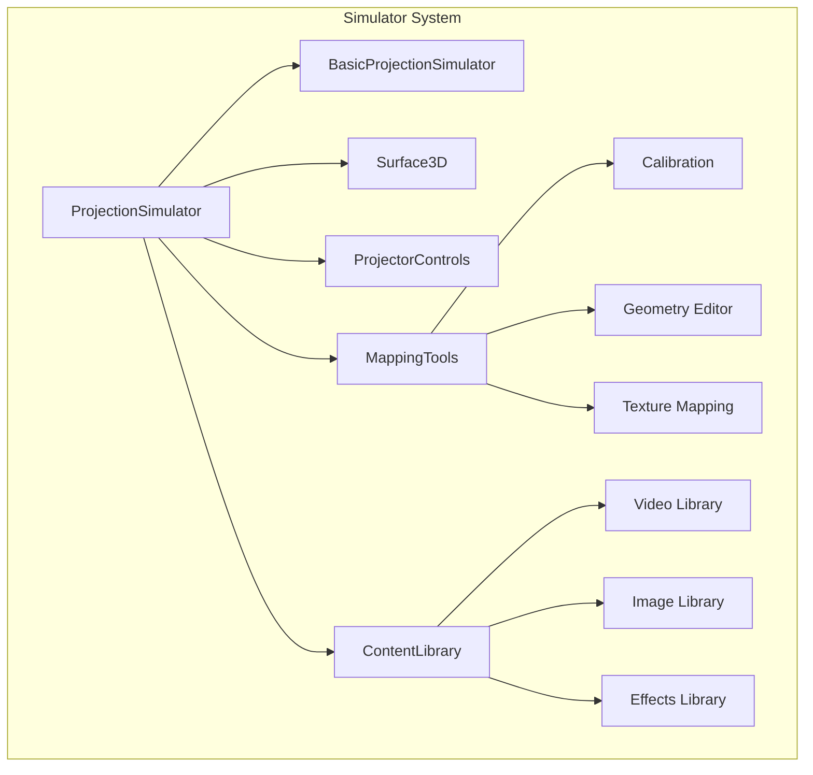
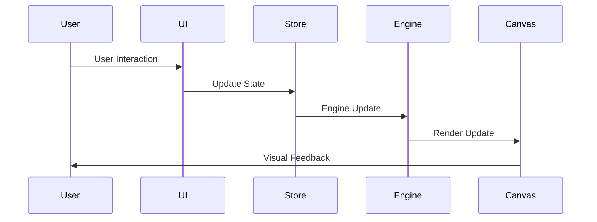
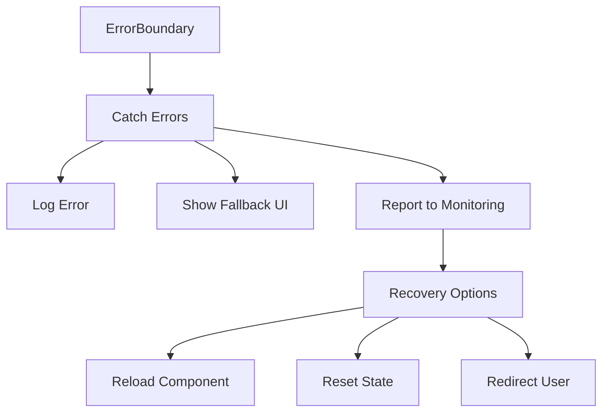
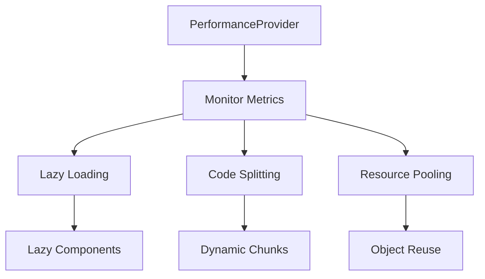

# Component Architecture

## React Component Hierarchy

## Component Categories

### 1. Provider Components
**Purpose**: Application-wide context and state management

- **MonitoringProvider**: Performance tracking and dev dashboard
- **PerformanceProvider**: Performance optimization context
- **GameProvider**: Game state and engine management
- **ErrorBoundary**: Error handling and recovery

### 2. 3D Scene Components
**Purpose**: WebGL rendering and 3D visualization

### 3. Game System Components
**Purpose**: Interactive game mechanics and UI

### 4. Simulator Components
**Purpose**: Projection mapping simulation and tools

## Component Interaction Patterns

### 1. Data Flow Pattern

### 2. Error Handling Pattern

### 3. Performance Optimization Pattern

## Component Responsibilities

### Core Components

| Component | Primary Responsibility | Secondary Responsibilities |
|-----------|----------------------|---------------------------|
| App.tsx | Application root and routing | Canvas setup, layout structure |
| MainScene | 3D scene orchestration | Lighting, environment, cameras |
| MonitoringProvider | Performance tracking | Development tools, debugging |
| ErrorBoundary | Error capture and recovery | User feedback, error reporting |

### 3D Rendering Components

| Component | Purpose | Dependencies |
|-----------|---------|--------------|
| SacredGeometry | Mathematical 3D forms | Three.js, R3F |
| ProjectShowcase3D | Portfolio display | Drei, animations |
| PostProcessingEffects | Visual enhancement | EffectComposer, passes |
| InteractiveHero3D | Hero section 3D | User interaction, physics |

### Game Components

| Component | Purpose | State Dependencies |
|-----------|---------|-------------------|
| VJCareerGame3D | Main game logic | GameStore, PlayerStore |
| SimpleGameHUD | Game interface | Player stats, notifications |
| SkillTree | Character progression | Player experience, skills |
| Inventory | Item management | Player inventory, equipment |

### Utility Components

| Component | Purpose | Usage Pattern |
|-----------|---------|---------------|
| LazyLoader3D | Performance optimization | Async component loading |
| CodeSplitting | Bundle optimization | Dynamic imports |
| Button | Reusable UI element | Consistent styling, interactions |
| LoadingScreen | User feedback | Async operations, transitions |

## Component Communication

### 1. Props Down Pattern
- Parent components pass data via props
- Unidirectional data flow
- Type-safe interfaces

### 2. Context Up Pattern
- Global state via React Context
- Provider pattern for shared state
- Selective subscriptions

### 3. Event Delegation
- Custom events for component communication
- Game engine event system
- Performance monitoring events

## Scalability Considerations

### 1. Component Splitting
- Feature-based component organization
- Lazy loading for large components
- Dynamic imports for performance

### 2. State Management
- Modular store structure
- Selectors for efficient subscriptions
- Computed values for derived state

### 3. Type Safety
- Strict TypeScript interfaces
- Component prop validation
- Generic components for reusability