# Data Flow Architecture

## State Management Overview

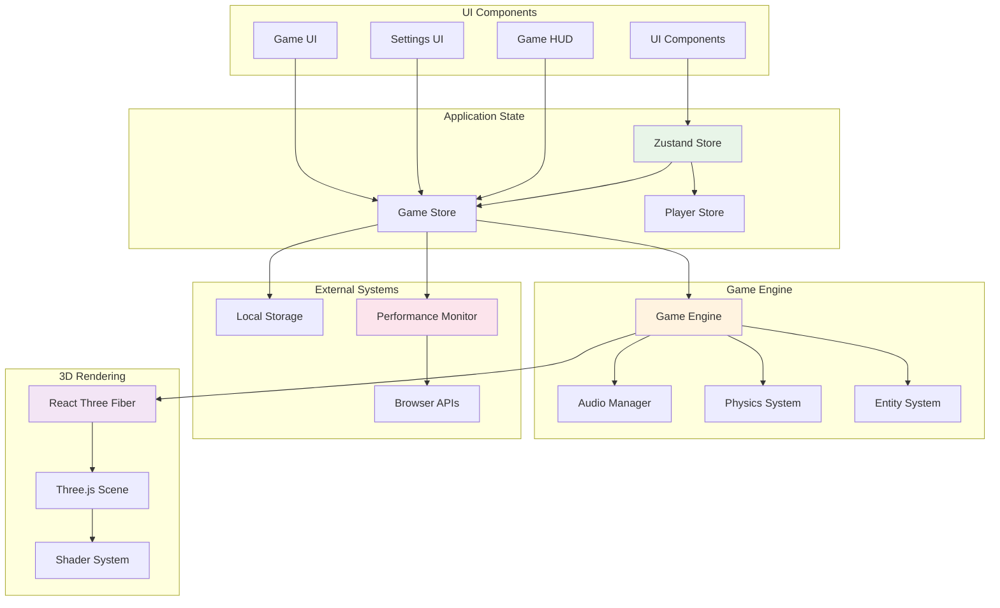

## Zustand Store Architecture

```mermaid
graph TD
    subgraph "GameStore State Slices"
        GAME_STATE[Game Engine State]
        UI_STATE[UI State]
        DIALOG[Dialog System]
        NOTIFY[Notification System]
        LOADING[Loading State]
        VJ_CAREER[VJ Career Game]
        SETTINGS[Game Settings]
    end

    subgraph "Game Engine State"
        INIT[isInitialized]
        RUNNING[isRunning]
        PAUSED[isPaused]
        SCENE[currentScene]
    end

    subgraph "UI State"
        HUD_SHOW[showHUD]
        MENU[showMenu]
        INVENTORY[showInventory]
        SKILLS[showSkillTree]
        ACHIEVEMENTS[showAchievements]
        SETTINGS_UI[showSettings]
    end

    subgraph "VJ Career State"
        PLAYER_DATA[Player Stats]
        VENUE[Current Venue]
        PERFORMING[Performance State]
    end

    subgraph "Settings State"
        GRAPHICS[Graphics Settings]
        AUDIO_SETTINGS[Audio Settings]
        CONTROLS[Control Settings]
        ACCESSIBILITY[Accessibility]
    end

    GAME_STATE --> INIT
    GAME_STATE --> RUNNING
    GAME_STATE --> PAUSED
    GAME_STATE --> SCENE

    UI_STATE --> HUD_SHOW
    UI_STATE --> MENU
    UI_STATE --> INVENTORY
    UI_STATE --> SKILLS
    UI_STATE --> ACHIEVEMENTS
    UI_STATE --> SETTINGS_UI

    VJ_CAREER --> PLAYER_DATA
    VJ_CAREER --> VENUE
    VJ_CAREER --> PERFORMING

    SETTINGS --> GRAPHICS
    SETTINGS --> AUDIO_SETTINGS
    SETTINGS --> CONTROLS
    SETTINGS --> ACCESSIBILITY
```

## Data Flow Patterns

### 1. Unidirectional Data Flow
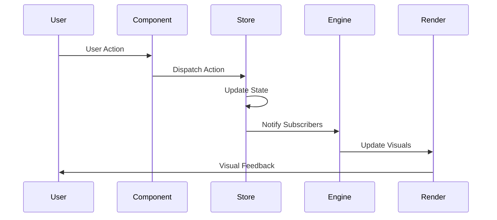

### 2. State Subscription Pattern
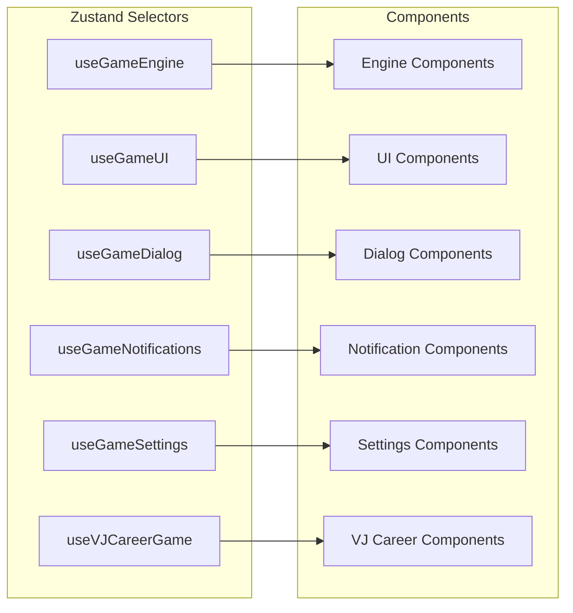

### 3. State Persistence Flow
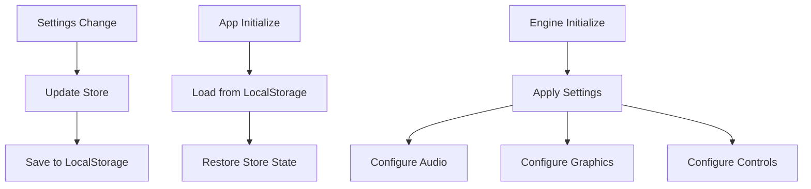

## State Management Details

### Game Store State Interface
```typescript
interface GameState {
  // Engine State
  isInitialized: boolean
  isRunning: boolean
  isPaused: boolean
  currentScene: string | null

  // UI State
  showHUD: boolean
  showMenu: boolean
  showInventory: boolean
  showSkillTree: boolean
  showAchievements: boolean
  showSettings: boolean

  // Dialog System
  currentDialog: DialogData | null

  // Notifications
  notifications: NotificationData[]

  // Loading State
  loading: {
    isLoading: boolean
    loadingText: string
    progress: number
  }

  // VJ Career Game
  vjCareerGame: VJCareerState

  // Settings
  settings: GameSettings
}
```

### State Update Patterns

#### 1. Synchronous Updates
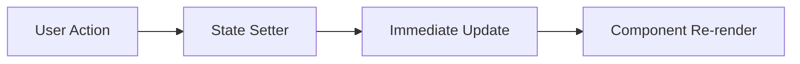

#### 2. Asynchronous Updates with Side Effects
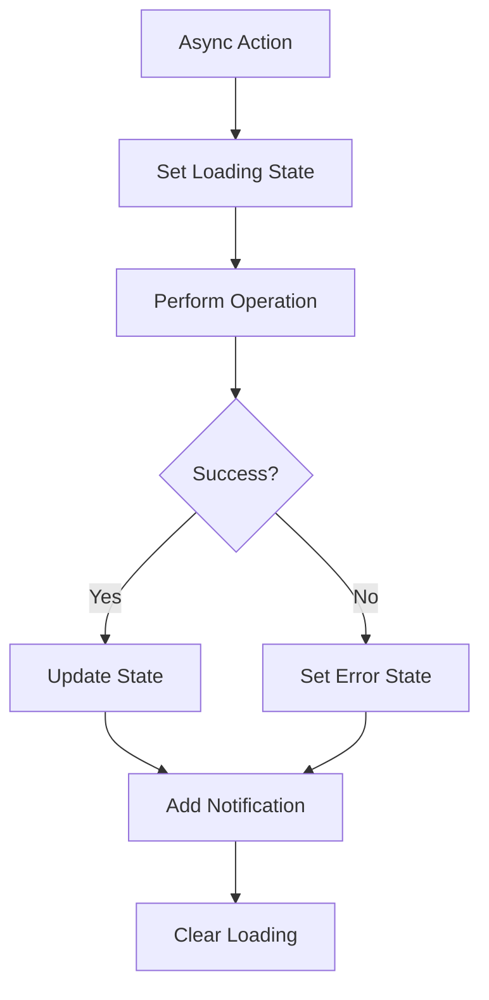

#### 3. Computed State Pattern
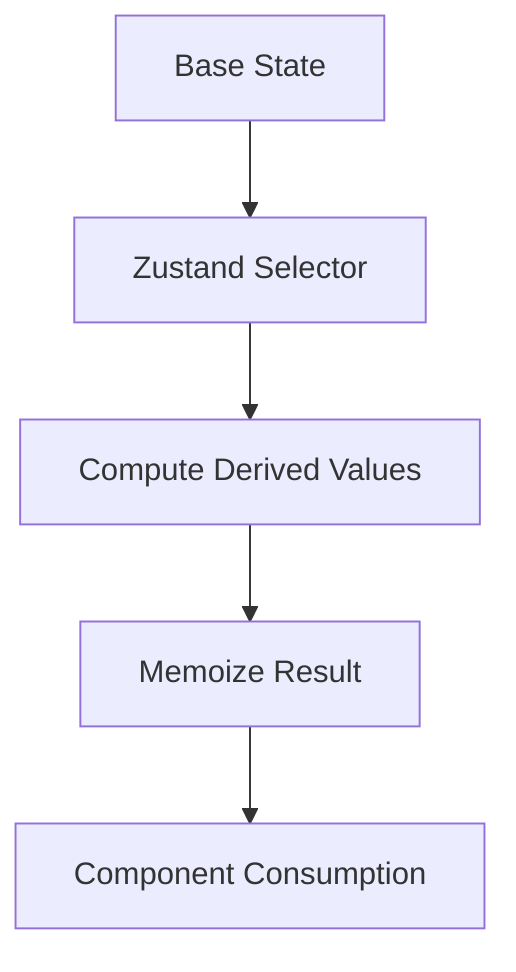

## State Synchronization

### 1. Engine-Store Synchronization
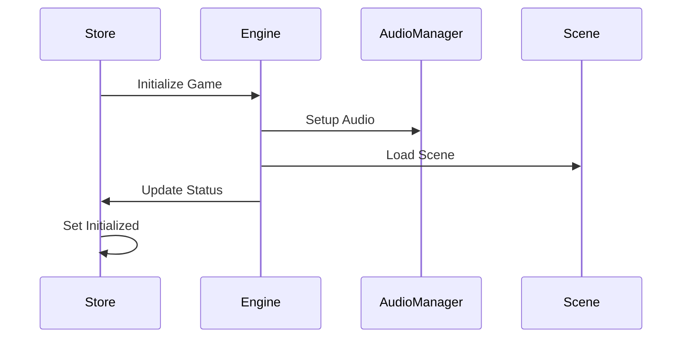

### 2. Settings Synchronization
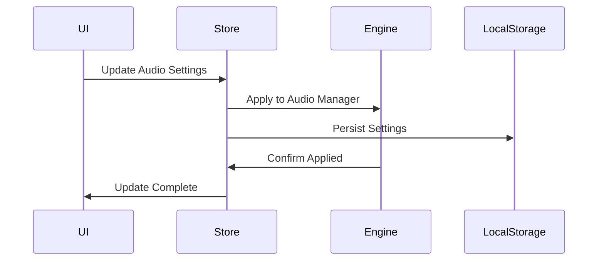

### 3. Game Progress Synchronization
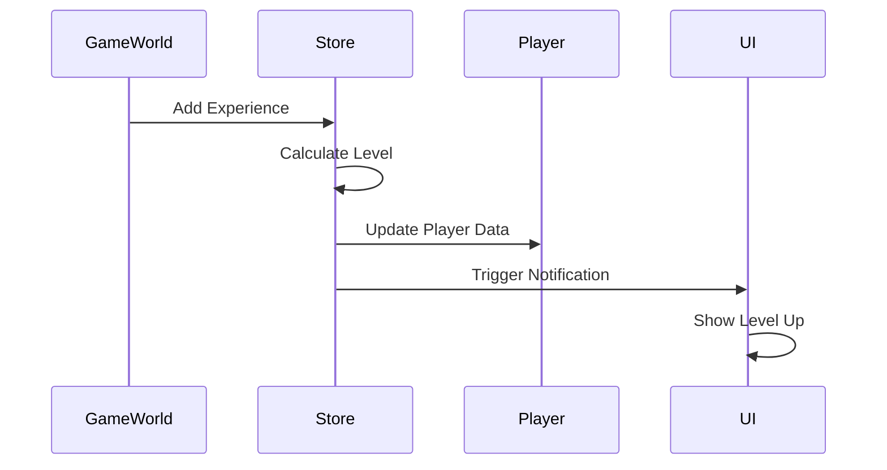

## Performance Optimization

### 1. Selective Subscriptions
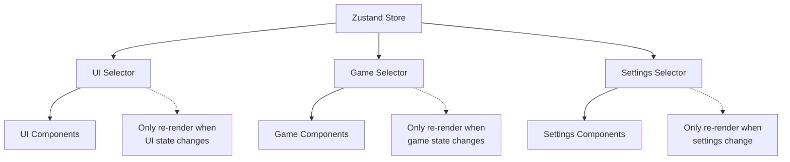

### 2. State Batching
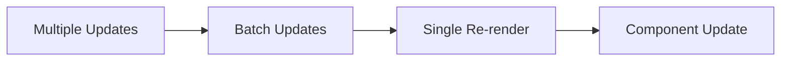

### 3. Middleware Integration
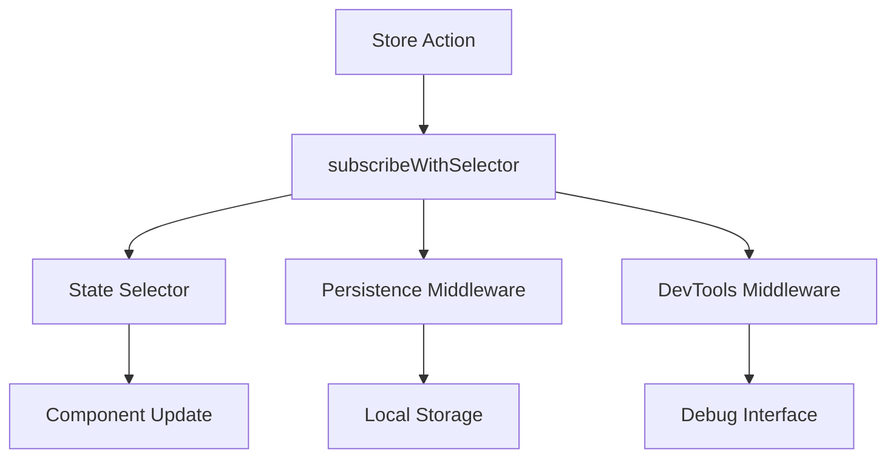

## Error Handling in State

### 1. Error State Management
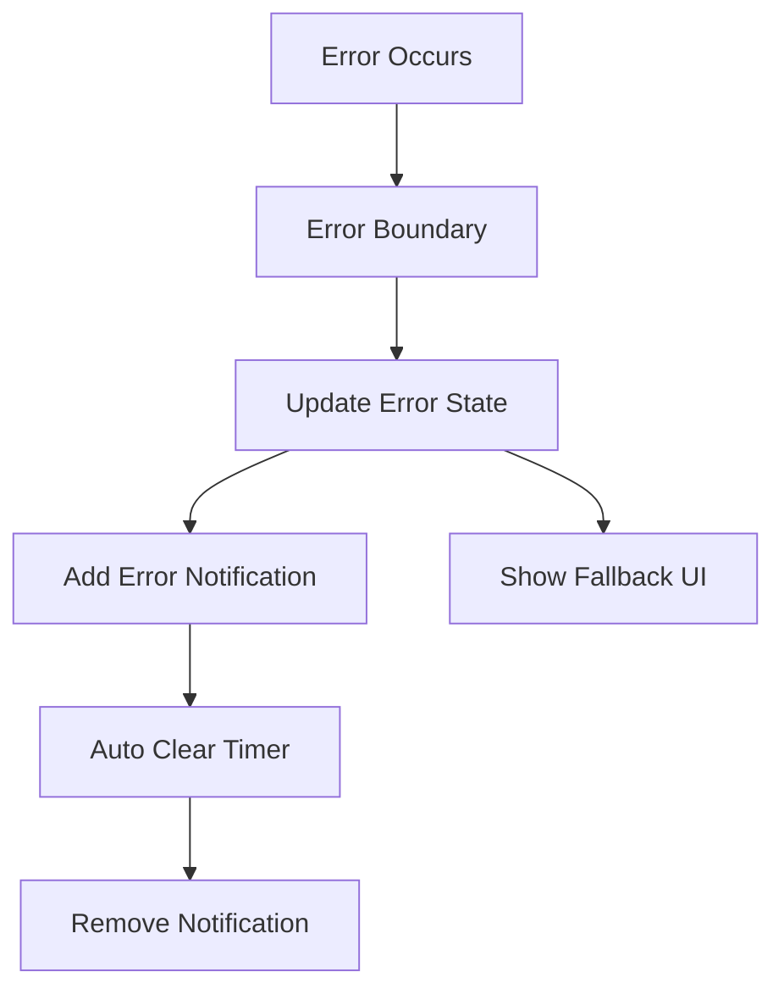

### 2. Recovery Mechanisms
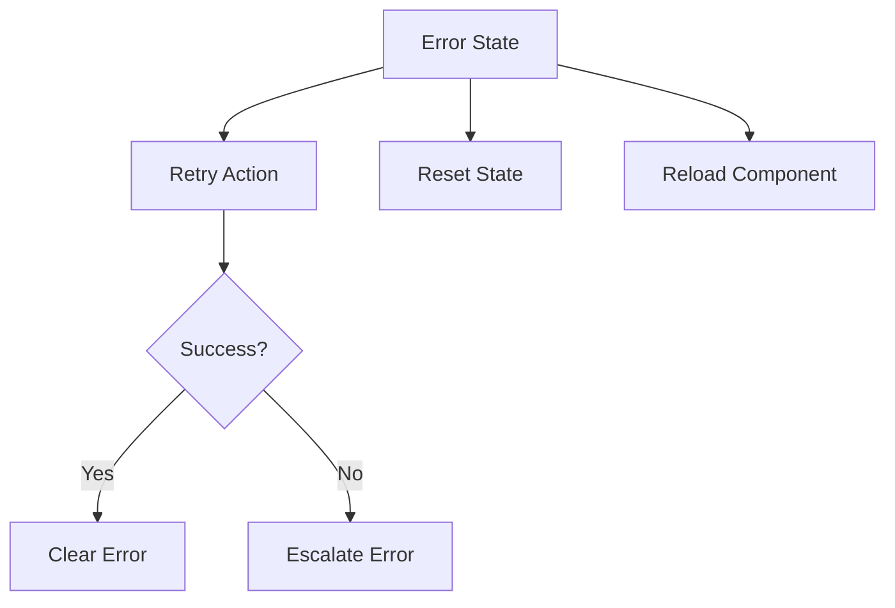

## Integration Points

### 1. Three.js Integration
- State drives 3D scene updates
- Performance monitoring for frame rates
- Settings control rendering quality

### 2. Audio System Integration
- Volume controls from settings state
- Game events trigger audio feedback
- Mute state affects all audio output

### 3. Local Storage Integration
- Automatic settings persistence
- Game progress saving
- Error state recovery

### 4. Performance Monitoring Integration
- State changes tracked for performance
- Store subscription metrics
- Memory usage monitoring