# 3D Rendering Pipeline Architecture

## Three.js Integration Pipeline

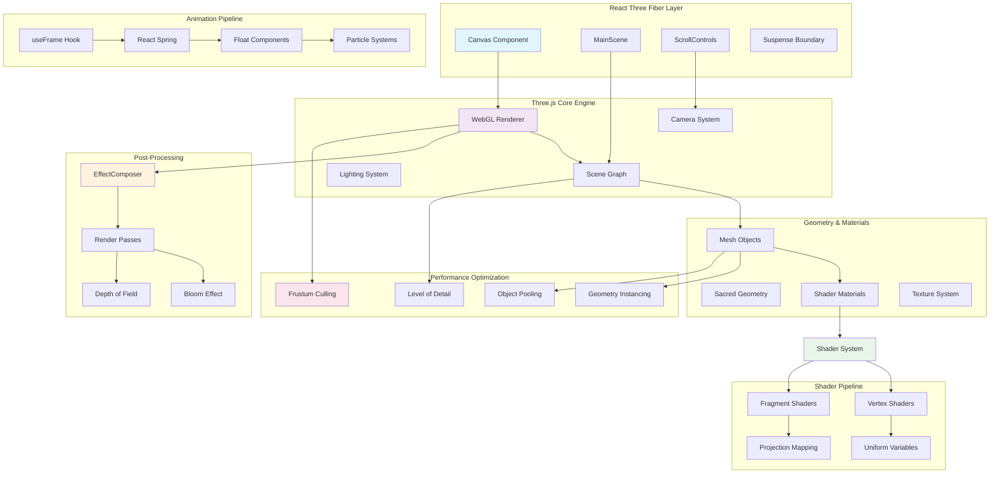

## Rendering Architecture Layers

### 1. React Three Fiber Integration
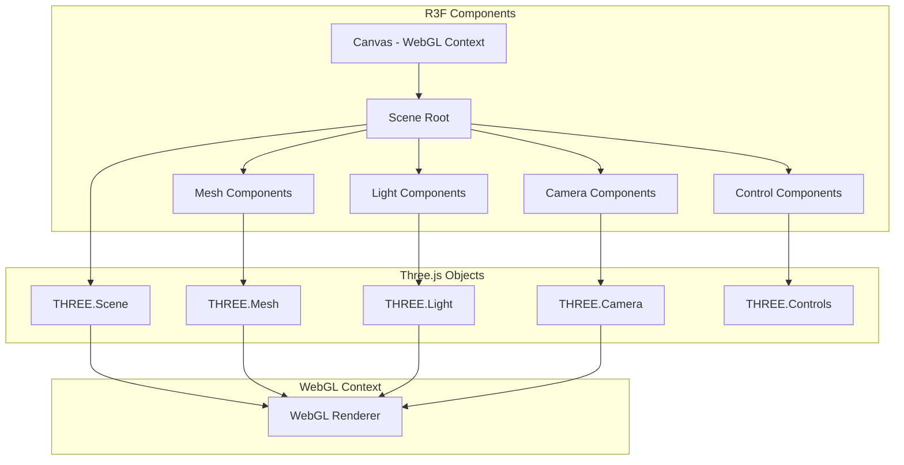

### 2. Shader System Architecture
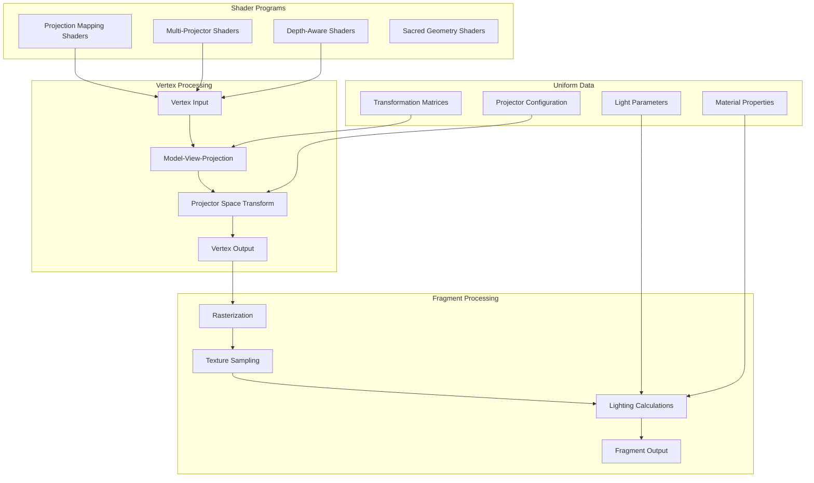

### 3. Projection Mapping Pipeline
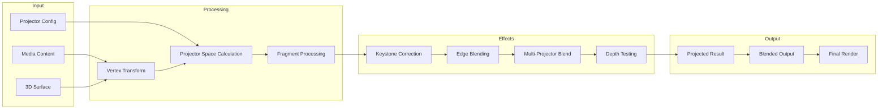

## Sacred Geometry Rendering

### 1. Mathematical Form Generation
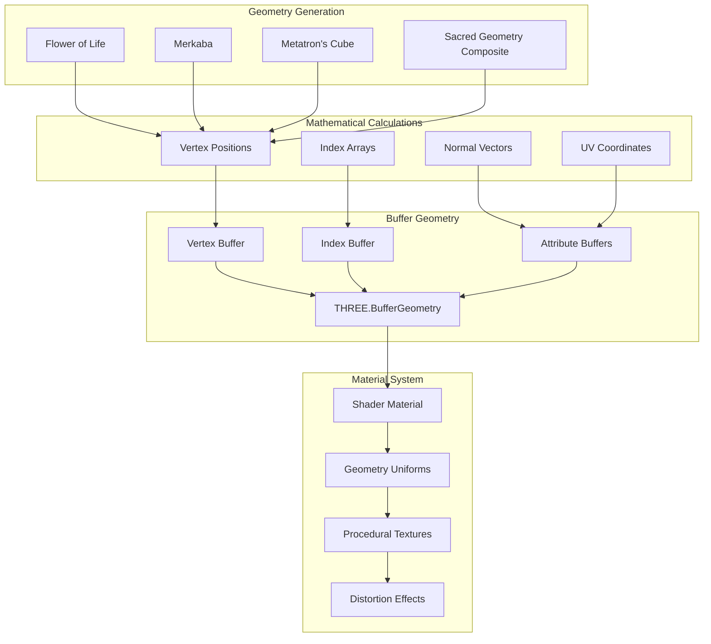

### 2. Sacred Geometry Animation Pipeline
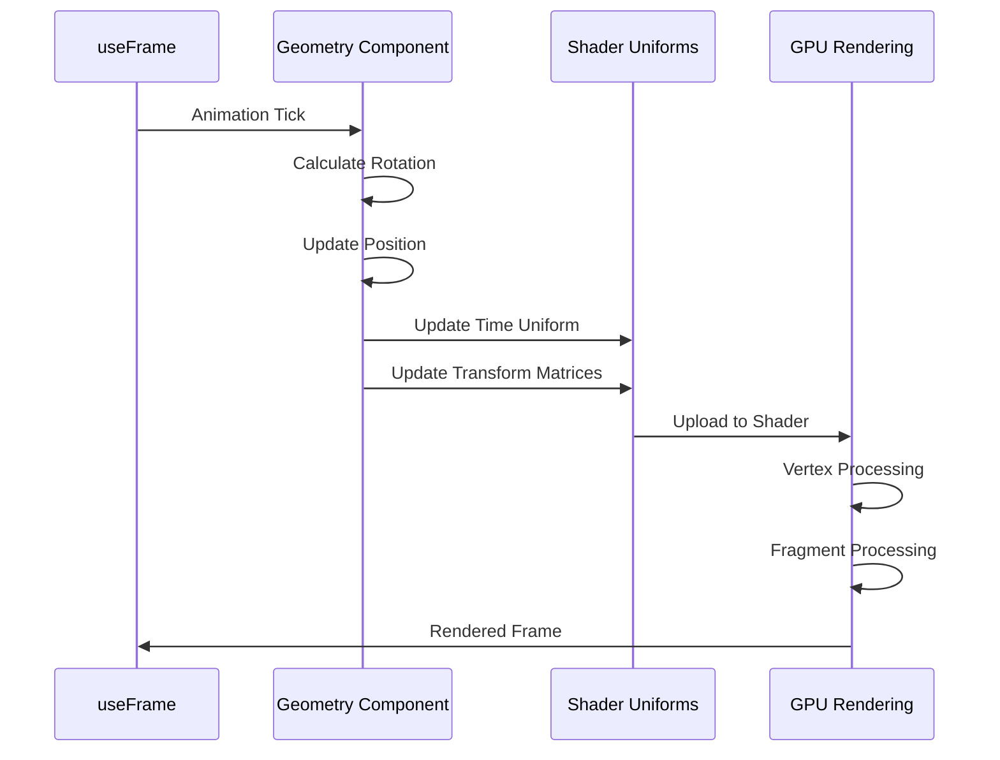

## Performance Optimization Pipeline

### 1. Rendering Optimization
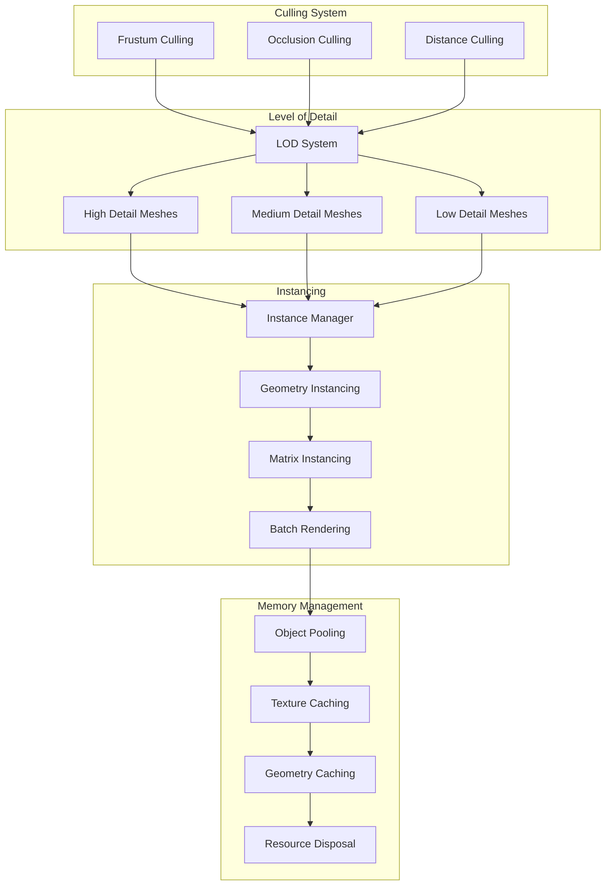

### 2. Frame Rate Optimization
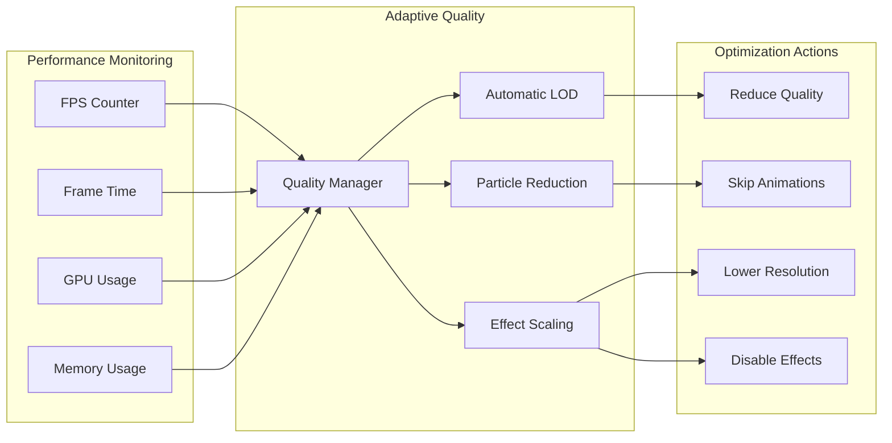

## Post-Processing Pipeline

### 1. Effect Composition
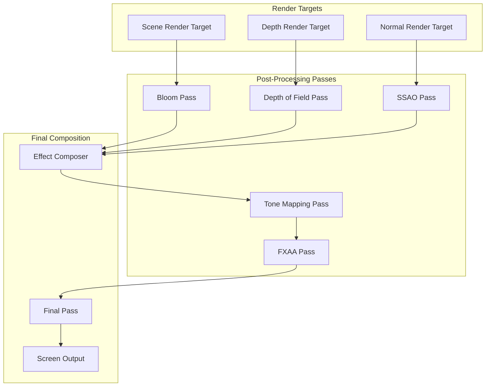

### 2. Shader Effect Pipeline
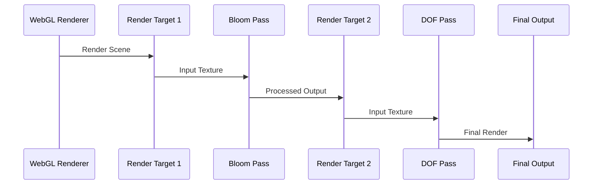

## Asset Loading Pipeline

### 1. Texture Loading
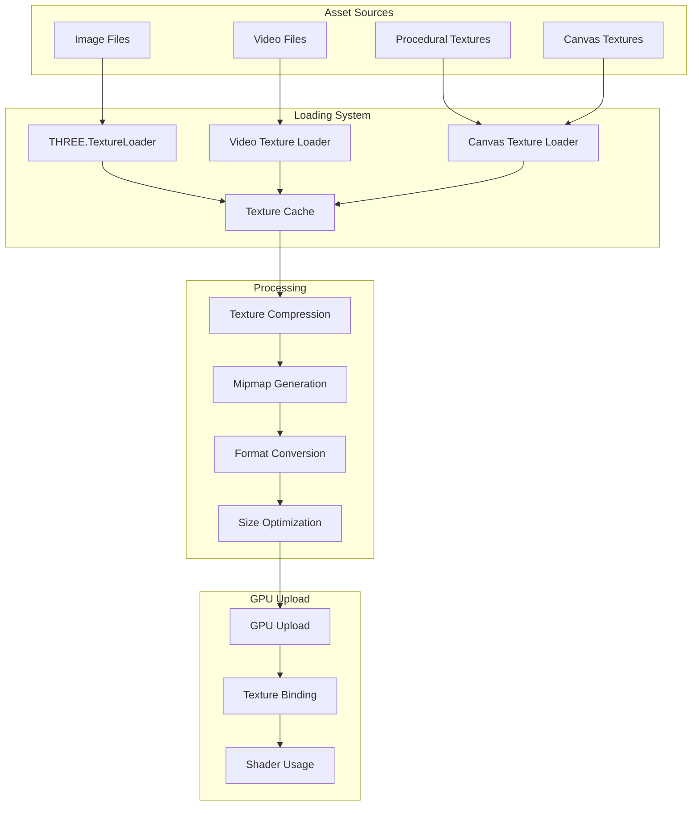

### 2. Geometry Loading
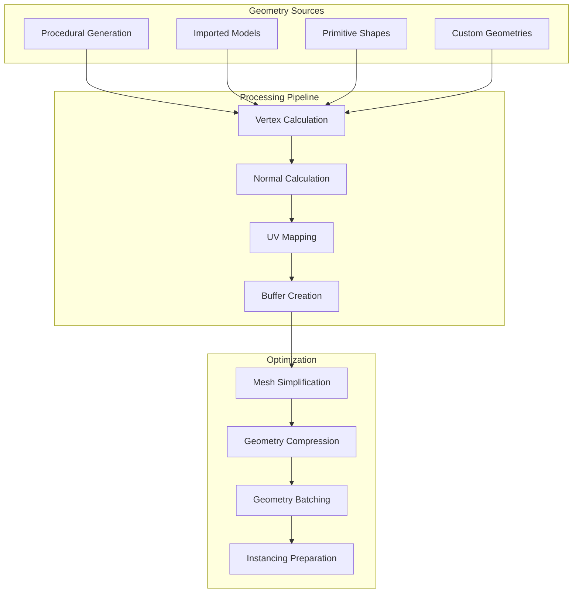

## Integration with React Components

### 1. Component-Three.js Bridge
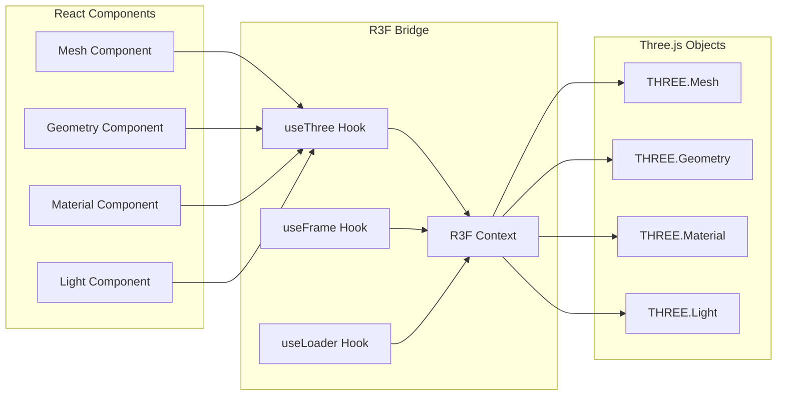

### 2. State Synchronization
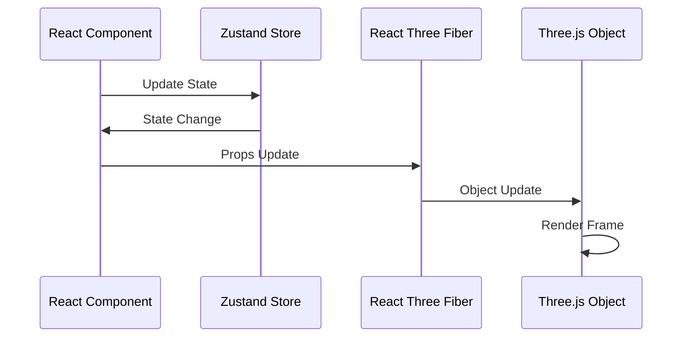

## Performance Metrics

### 1. Rendering Performance
- **Target Frame Rate**: 60 FPS
- **Frame Time Budget**: 16.67ms
- **GPU Memory Usage**: < 500MB
- **Draw Calls**: < 200 per frame
- **Vertices**: < 100K per frame

### 2. Asset Performance
- **Texture Memory**: < 200MB
- **Geometry Memory**: < 50MB
- **Load Time**: < 3 seconds
- **Cache Hit Rate**: > 80%

### 3. Shader Performance
- **Vertex Shader Complexity**: < 100 instructions
- **Fragment Shader Complexity**: < 200 instructions
- **Uniform Updates**: < 50 per frame
- **Texture Samples**: < 8 per fragment