# Performance Architecture

## Performance Optimization System

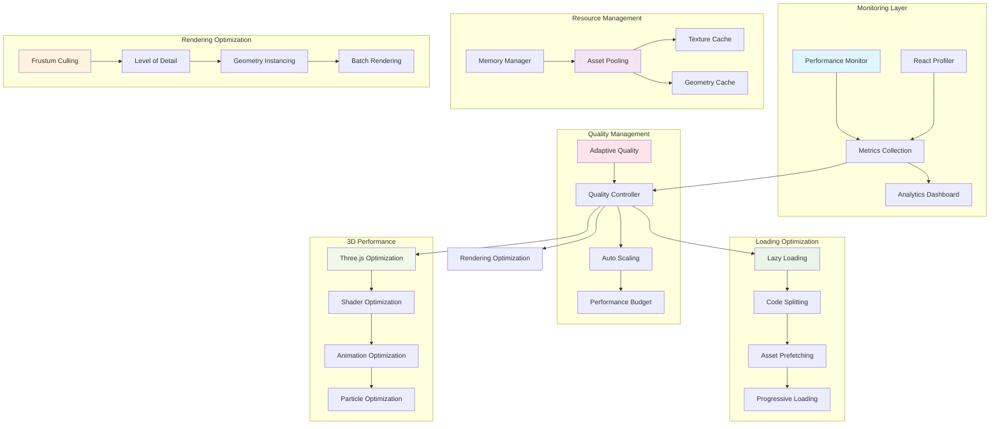

## Performance Monitoring System

### 1. Real-Time Monitoring
```mermaid
graph TD
    subgraph "Performance Metrics"
        FPS[Frame Rate (FPS)]
        FRAME_TIME[Frame Time (ms)]
        GPU_USAGE[GPU Usage (%)]
        MEMORY[Memory Usage (MB)]
        DRAW_CALLS[Draw Calls]
        VERTICES[Vertex Count]
    end

    subgraph "Resource Metrics"
        BUNDLE_SIZE[Bundle Size]
        ASSET_SIZE[Asset Size]
        CACHE_HIT[Cache Hit Rate]
        LOAD_TIME[Load Time]
        NETWORK[Network Usage]
    end

    subgraph "User Experience Metrics"
        CLS[Cumulative Layout Shift]
        FCP[First Contentful Paint]
        LCP[Largest Contentful Paint]
        TTI[Time to Interactive]
        INP[Interaction to Next Paint]
    end

    subgraph "Three.js Metrics"
        RENDER_TIME[Render Time]
        GEOMETRY_COUNT[Geometry Count]
        TEXTURE_COUNT[Texture Count]
        SHADER_COUNT[Shader Programs]
        UNIFORM_UPDATES[Uniform Updates]
    end

    FPS --> MONITORING[Performance Monitor]
    FRAME_TIME --> MONITORING
    GPU_USAGE --> MONITORING
    MEMORY --> MONITORING

    BUNDLE_SIZE --> MONITORING
    ASSET_SIZE --> MONITORING
    CACHE_HIT --> MONITORING

    CLS --> MONITORING
    FCP --> MONITORING
    LCP --> MONITORING

    RENDER_TIME --> MONITORING
    GEOMETRY_COUNT --> MONITORING
    TEXTURE_COUNT --> MONITORING

    MONITORING --> DASHBOARD[Analytics Dashboard]
    MONITORING --> ALERTS[Performance Alerts]
    MONITORING --> OPTIMIZATION[Auto Optimization]
```

### 2. Performance Profiling Pipeline
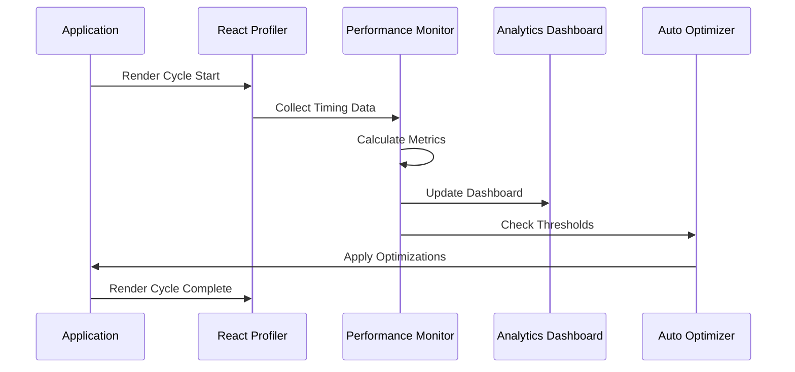

## Resource Management Architecture

### 1. Asset Pooling System
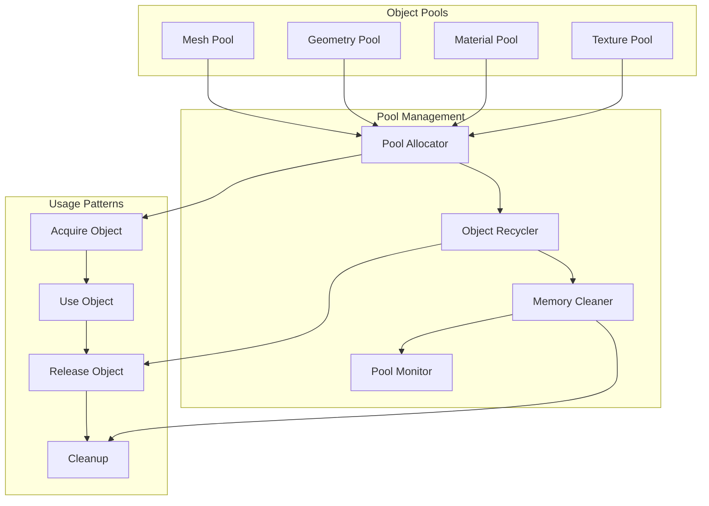

### 2. Memory Management Strategy
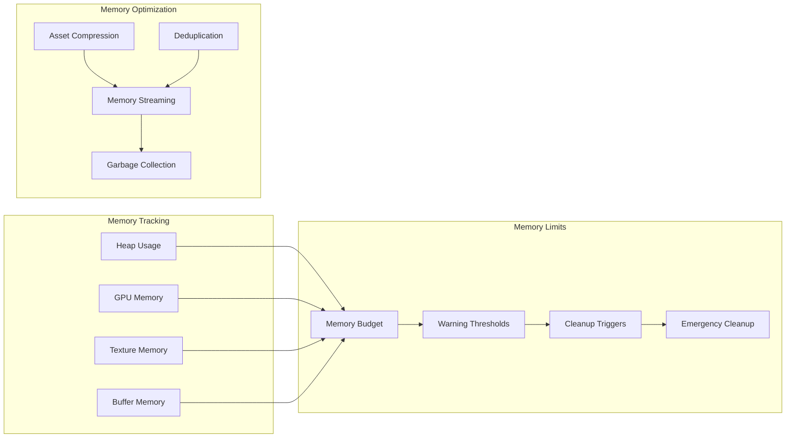

## Lazy Loading & Code Splitting

### 1. Component Lazy Loading
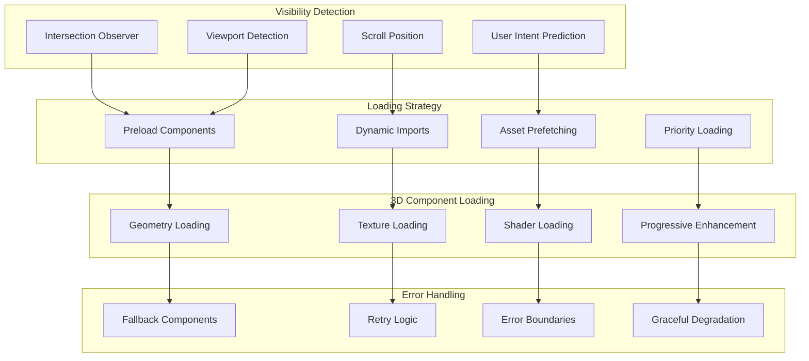

### 2. Bundle Optimization
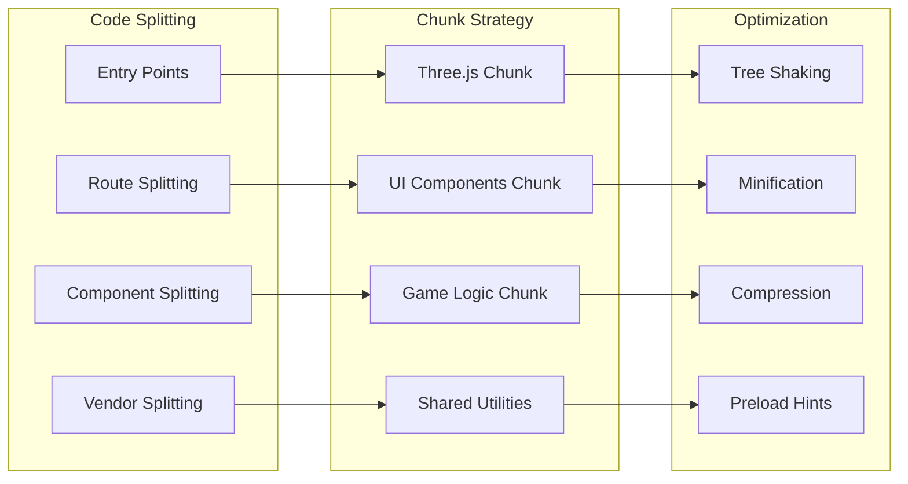

## 3D Rendering Optimization

### 1. Adaptive Quality System
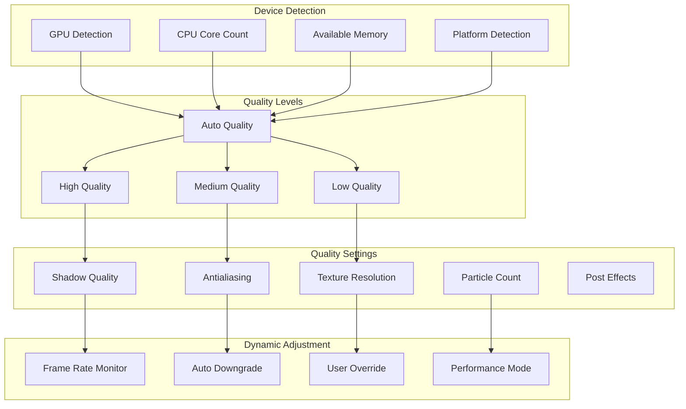

### 2. Rendering Pipeline Optimization
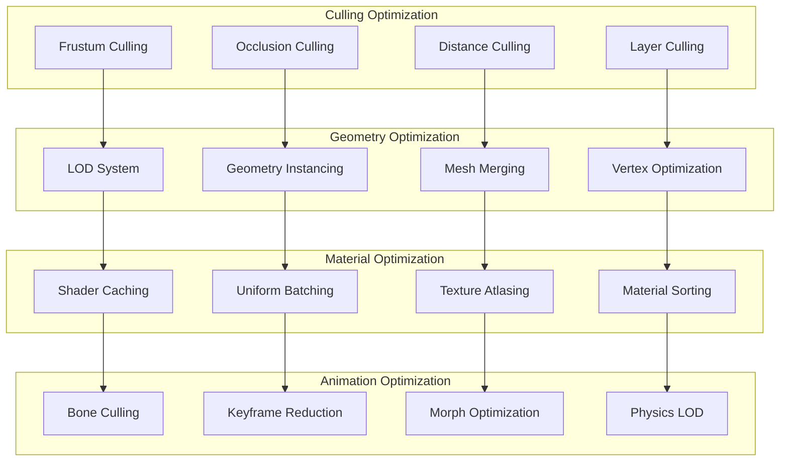

## Performance Budget System

### 1. Budget Allocation
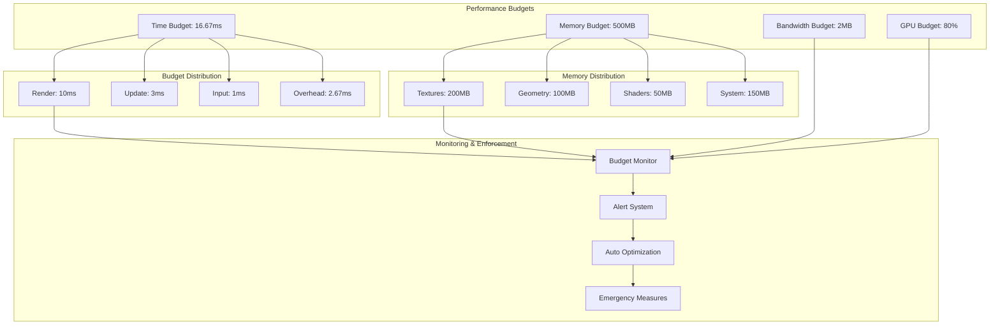

### 2. Budget Enforcement
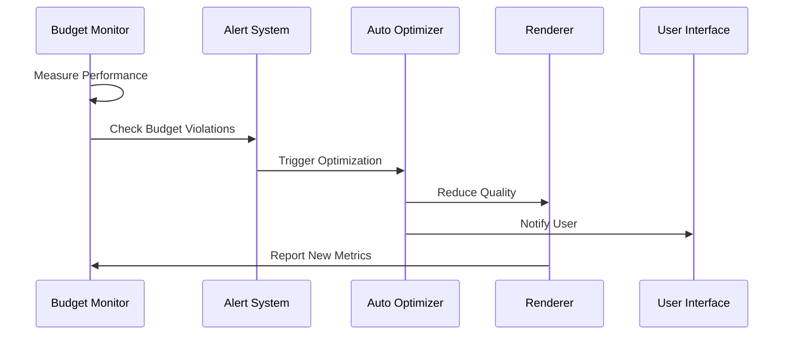

## Animation Manager Architecture

### 1. Animation System
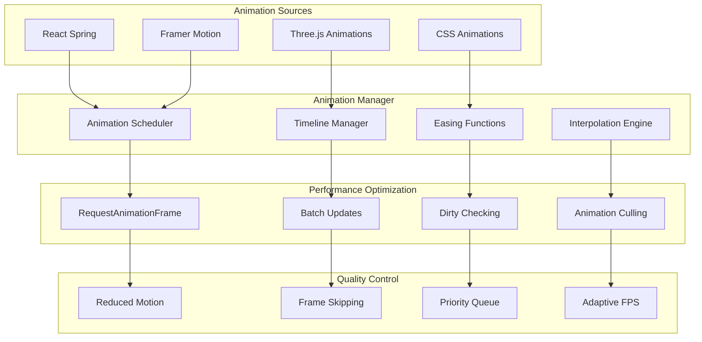

### 2. Particle System Optimization
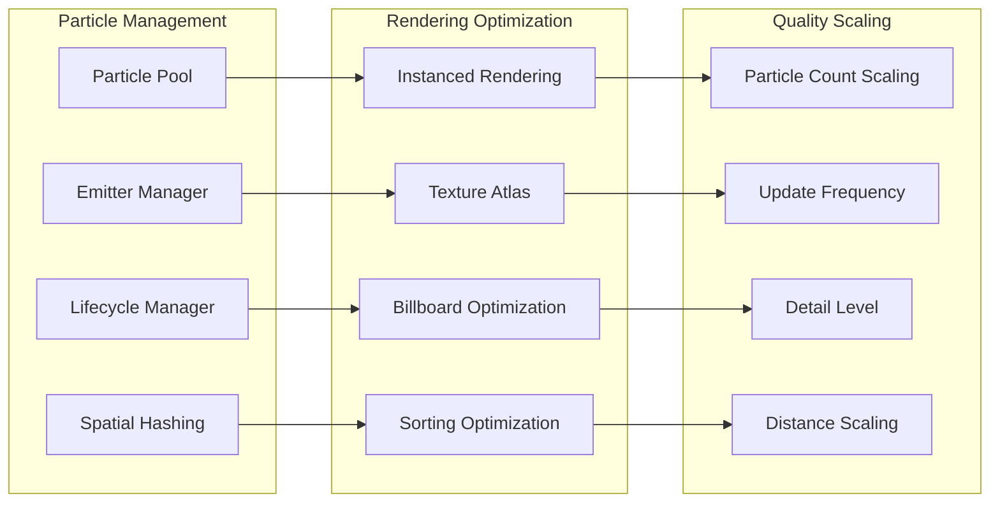

## Performance Metrics & KPIs

### 1. Target Performance Metrics

| Metric | Target | Warning | Critical |
|--------|---------|---------|----------|
| Frame Rate | 60 FPS | < 45 FPS | < 30 FPS |
| Frame Time | 16.67ms | > 22ms | > 33ms |
| GPU Usage | < 80% | > 90% | > 95% |
| Memory Usage | < 500MB | > 750MB | > 1GB |
| Load Time | < 3s | > 5s | > 10s |
| Bundle Size | < 2MB | > 3MB | > 5MB |

### 2. Optimization Strategies

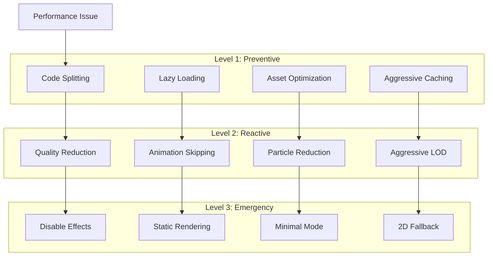

### 3. Continuous Optimization
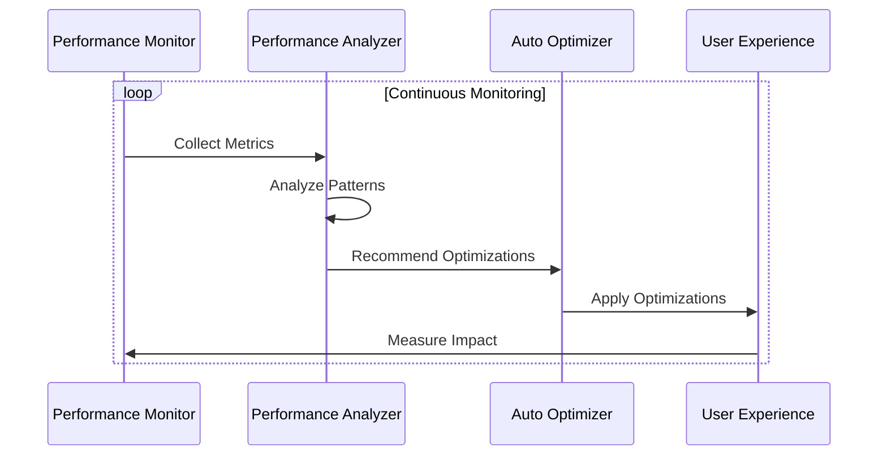

## Integration with Monitoring System

### 1. Performance Dashboard
- Real-time FPS and frame time graphs
- Memory usage visualization
- GPU utilization charts
- Network performance metrics
- User experience scores

### 2. Automated Optimization
- Dynamic quality adjustment
- Automatic resource cleanup
- Progressive enhancement/degradation
- User preference learning

### 3. Development Tools
- Performance profiling integration
- Bundle analysis reports
- Asset optimization recommendations
- Performance regression detection