# Security Architecture

## Security Layer Overview

```mermaid
graph TB
    subgraph "Client Security"
        CSP[Content Security Policy]
        XSS[XSS Protection]
        CORS[CORS Configuration]
        SANITIZATION[Input Sanitization]
    end

    subgraph "Transport Security"
        HTTPS[HTTPS Enforcement]
        HSTS[HTTP Strict Transport Security]
        CERT[SSL Certificate]
        TLS[TLS Configuration]
    end

    subgraph "Application Security"
        ERROR_BOUNDARY[Error Boundaries]
        VALIDATION[Input Validation]
        AUTH[Authentication]
        PERMISSIONS[Permission System]
    end

    subgraph "Data Security"
        ENCRYPTION[Data Encryption]
        STORAGE[Secure Storage]
        PII[PII Protection]
        LOGS[Secure Logging]
    end

    subgraph "Infrastructure Security"
        HELMET[Helmet Middleware]
        HEADERS[Security Headers]
        MONITORING[Security Monitoring]
        INTRUSION[Intrusion Detection]
    end

    subgraph "Asset Security"
        INTEGRITY[Subresource Integrity]
        ORIGIN[Origin Validation]
        ASSET_VALIDATION[Asset Validation]
        CDN_SECURITY[CDN Security]
    end

    CSP --> HELMET
    XSS --> HELMET
    CORS --> HELMET
    SANITIZATION --> VALIDATION

    HTTPS --> HSTS
    HSTS --> CERT
    CERT --> TLS

    ERROR_BOUNDARY --> MONITORING
    VALIDATION --> AUTH
    AUTH --> PERMISSIONS

    ENCRYPTION --> STORAGE
    STORAGE --> PII
    PII --> LOGS

    HELMET --> HEADERS
    HEADERS --> MONITORING
    MONITORING --> INTRUSION

    INTEGRITY --> ORIGIN
    ORIGIN --> ASSET_VALIDATION
    ASSET_VALIDATION --> CDN_SECURITY

    style CSP fill:#e1f5fe
    style HELMET fill:#f3e5f5
    style ERROR_BOUNDARY fill:#e8f5e8
    style ENCRYPTION fill:#fff3e0
    style HTTPS fill:#fce4ec
```

## Content Security Policy (CSP)

### 1. CSP Configuration
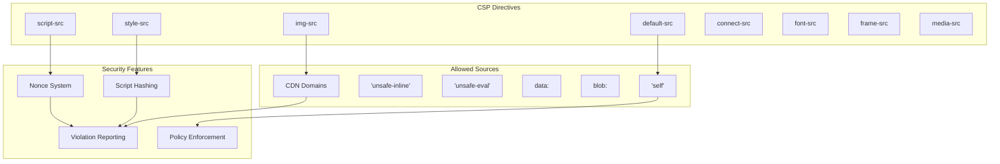

### 2. CSP Implementation
```javascript
// Express Helmet Configuration
const cspConfig = {
  directives: {
    defaultSrc: ["'self'"],
    scriptSrc: [
      "'self'",
      "'unsafe-inline'", // For React inline scripts
      "https://cdn.jsdelivr.net", // For CDN assets
      "https://unpkg.com"
    ],
    styleSrc: [
      "'self'",
      "'unsafe-inline'", // For styled-components
      "https://fonts.googleapis.com"
    ],
    imgSrc: [
      "'self'",
      "data:", // For base64 images
      "blob:", // For generated images
      "https:"
    ],
    connectSrc: [
      "'self'",
      "wss:", // For WebSocket connections
      "https://api.example.com"
    ],
    fontSrc: [
      "'self'",
      "https://fonts.gstatic.com"
    ],
    mediaSrc: ["'self'", "blob:"],
    frameSrc: ["'none'"],
    objectSrc: ["'none'"],
    baseUri: ["'self'"],
    formAction: ["'self'"]
  },
  reportUri: "/csp-violation-report"
}
```

## Security Headers Implementation

### 1. Helmet.js Configuration
```mermaid
graph TD
    subgraph "Security Headers"
        HELMET_CONFIG[Helmet Configuration]
        CSP_HEADER[Content-Security-Policy]
        XFRAME[X-Frame-Options]
        XSS_PROTECTION[X-XSS-Protection]
        CONTENT_TYPE[X-Content-Type-Options]
        REFERRER[Referrer-Policy]
        PERMISSIONS[Permissions-Policy]
        EXPECT_CT[Expect-CT]
    end

    subgraph "Transport Security"
        HSTS_HEADER[Strict-Transport-Security]
        HPKP[HTTP Public Key Pinning]
        SECURE_COOKIES[Secure Cookie Settings]
    end

    subgraph "Privacy Headers"
        DNT[Do Not Track]
        PRIVACY_POLICY[Privacy-Policy]
        CROSS_ORIGIN[Cross-Origin-*]
    end

    HELMET_CONFIG --> CSP_HEADER
    HELMET_CONFIG --> XFRAME
    HELMET_CONFIG --> XSS_PROTECTION
    HELMET_CONFIG --> CONTENT_TYPE
    HELMET_CONFIG --> REFERRER
    HELMET_CONFIG --> PERMISSIONS
    HELMET_CONFIG --> EXPECT_CT

    HELMET_CONFIG --> HSTS_HEADER
    HELMET_CONFIG --> HPKP
    HELMET_CONFIG --> SECURE_COOKIES

    HELMET_CONFIG --> DNT
    HELMET_CONFIG --> PRIVACY_POLICY
    HELMET_CONFIG --> CROSS_ORIGIN
```

### 2. Express Server Security Setup
```javascript
// Express Server with Security Middleware
const express = require('express');
const helmet = require('helmet');
const rateLimit = require('express-rate-limit');

const app = express();

// Helmet configuration
app.use(helmet({
  contentSecurityPolicy: cspConfig,
  hsts: {
    maxAge: 31536000,
    includeSubDomains: true,
    preload: true
  },
  frameguard: { action: 'deny' },
  noSniff: true,
  xssFilter: true,
  referrerPolicy: { policy: 'strict-origin-when-cross-origin' },
  permissionsPolicy: {
    features: {
      camera: ['none'],
      microphone: ['none'],
      geolocation: ['none'],
      payment: ['none']
    }
  }
}));

// Rate limiting
const limiter = rateLimit({
  windowMs: 15 * 60 * 1000, // 15 minutes
  max: 100, // limit each IP to 100 requests per windowMs
  message: 'Too many requests from this IP'
});
app.use(limiter);
```

## Error Boundary Security

### 1. Error Boundary Architecture
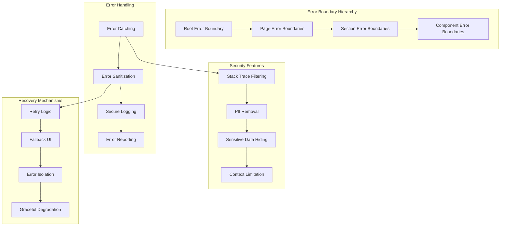

### 2. Secure Error Reporting
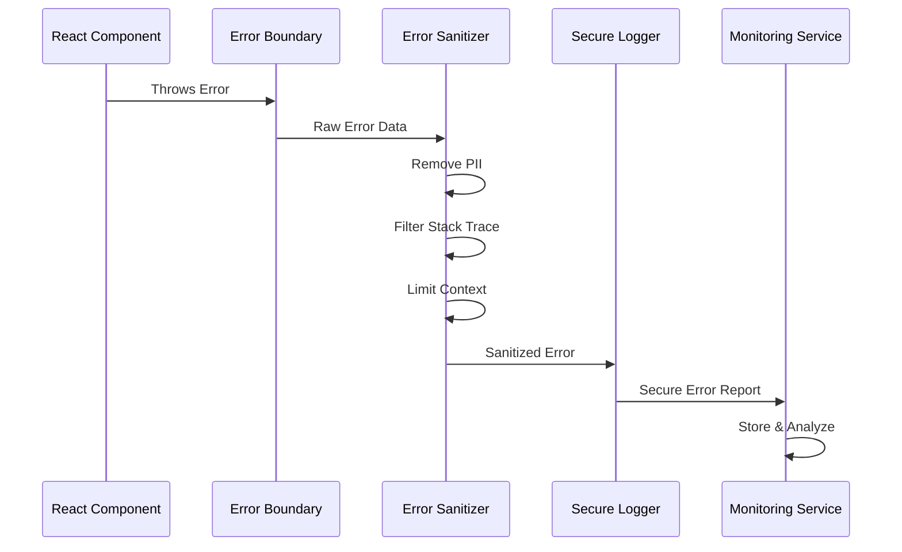

## Input Validation & Sanitization

### 1. Input Security Pipeline
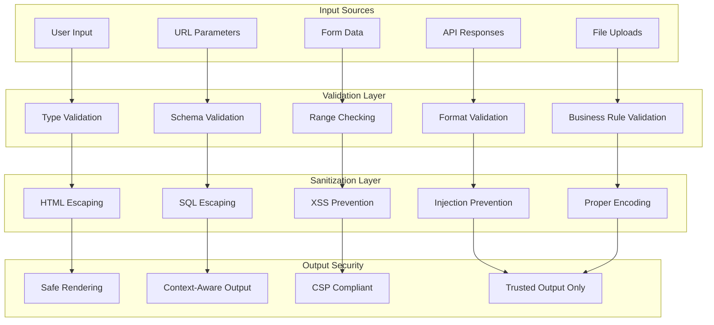

### 2. React Component Security
```typescript
// Secure Input Component
interface SecureInputProps {
  value: string;
  onChange: (value: string) => void;
  validator?: (value: string) => boolean;
  sanitizer?: (value: string) => string;
  maxLength?: number;
  allowedChars?: RegExp;
}

const SecureInput: React.FC<SecureInputProps> = ({
  value,
  onChange,
  validator = () => true,
  sanitizer = (v) => v,
  maxLength = 1000,
  allowedChars
}) => {
  const handleChange = (e: React.ChangeEvent<HTMLInputElement>) => {
    let newValue = e.target.value;

    // Length validation
    if (newValue.length > maxLength) {
      newValue = newValue.substring(0, maxLength);
    }

    // Character filtering
    if (allowedChars && !allowedChars.test(newValue)) {
      return; // Reject invalid characters
    }

    // Sanitization
    newValue = sanitizer(newValue);

    // Validation
    if (validator(newValue)) {
      onChange(newValue);
    }
  };

  return (
    <input
      type="text"
      value={value}
      onChange={handleChange}
      autoComplete="off"
      spellCheck="false"
    />
  );
};
```

## Asset Security

### 1. Subresource Integrity (SRI)
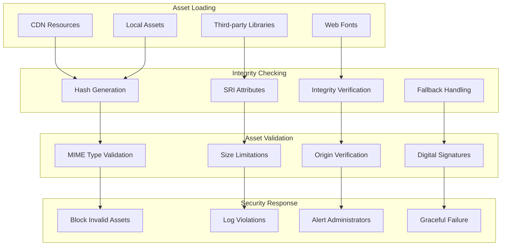

### 2. Asset Security Implementation
```html
<!-- SRI Implementation in HTML -->
<script
  src="https://cdn.jsdelivr.net/npm/three@0.180.0/build/three.min.js"
  integrity="sha384-HASH_VALUE_HERE"
  crossorigin="anonymous">
</script>

<link
  href="https://fonts.googleapis.com/css2?family=Inter:wght@400;500;600&display=swap"
  rel="stylesheet"
  integrity="sha384-HASH_VALUE_HERE"
  crossorigin="anonymous">
```

## Authentication & Authorization

### 1. Authentication Flow
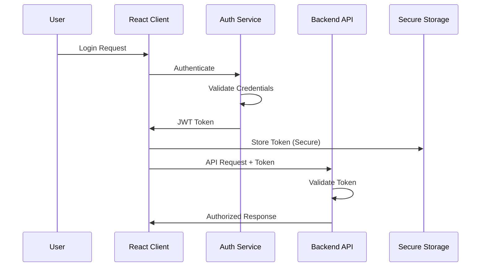

### 2. Permission System
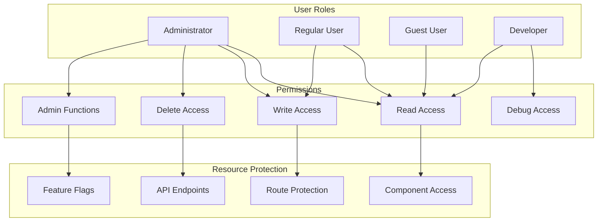

## Data Protection

### 1. Sensitive Data Handling
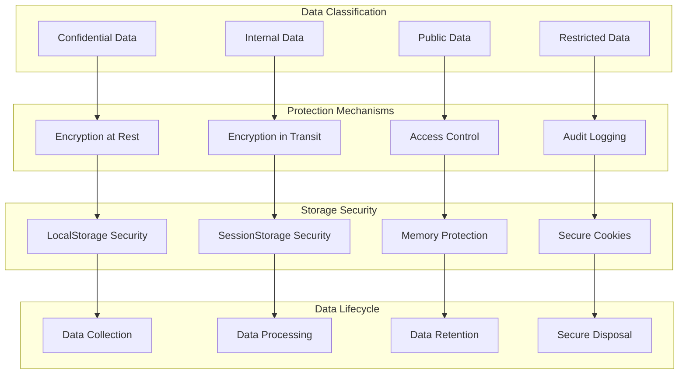

### 2. PII Protection
```typescript
// PII Protection Utility
class PIIProtector {
  private static sensitivePatterns = [
    /\b\d{3}-\d{2}-\d{4}\b/g, // SSN
    /\b[A-Za-z0-9._%+-]+@[A-Za-z0-9.-]+\.[A-Z|a-z]{2,}\b/g, // Email
    /\b\d{4}\s?\d{4}\s?\d{4}\s?\d{4}\b/g, // Credit Card
    /\b\d{3}-\d{3}-\d{4}\b/g // Phone Number
  ];

  static sanitize(text: string): string {
    let sanitized = text;
    this.sensitivePatterns.forEach(pattern => {
      sanitized = sanitized.replace(pattern, '[REDACTED]');
    });
    return sanitized;
  }

  static maskEmail(email: string): string {
    const [local, domain] = email.split('@');
    const maskedLocal = local.charAt(0) + '*'.repeat(local.length - 2) + local.charAt(local.length - 1);
    return `${maskedLocal}@${domain}`;
  }

  static isContainsPII(text: string): boolean {
    return this.sensitivePatterns.some(pattern => pattern.test(text));
  }
}
```

## Security Monitoring

### 1. Security Event Monitoring
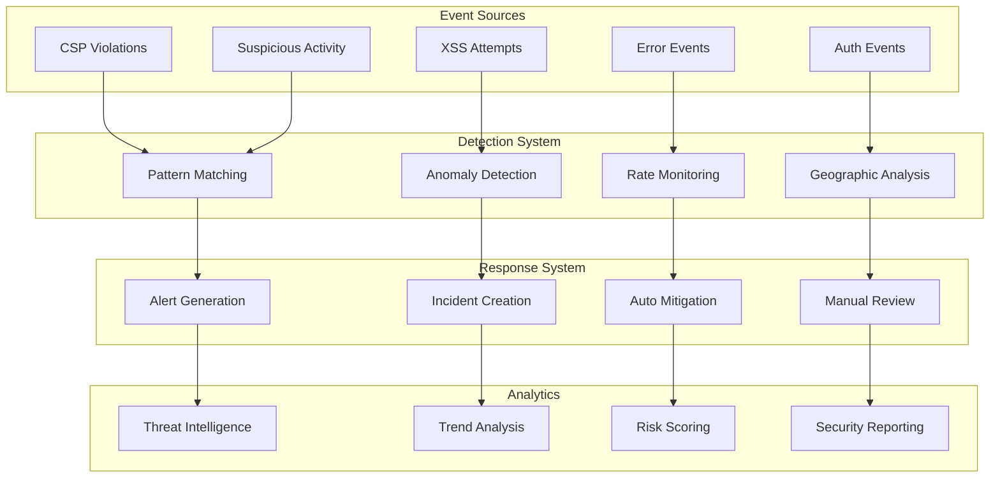

### 2. Security Metrics Dashboard
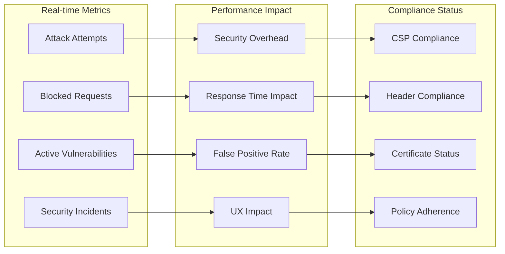

## Security Best Practices

### 1. Development Security
- **Code Review**: Security-focused code reviews
- **Static Analysis**: Automated security scanning
- **Dependency Scanning**: Third-party library vulnerability checks
- **Secrets Management**: Secure handling of API keys and credentials

### 2. Deployment Security
- **Infrastructure Security**: Secure server configuration
- **Network Security**: Firewall and network segmentation
- **Container Security**: Secure Docker configurations
- **CI/CD Security**: Secure build and deployment pipelines

### 3. Runtime Security
- **Real-time Monitoring**: Continuous security monitoring
- **Incident Response**: Automated incident response procedures
- **Patch Management**: Regular security updates
- **Backup Security**: Secure backup and recovery procedures

## Security Testing Strategy

### 1. Security Testing Types
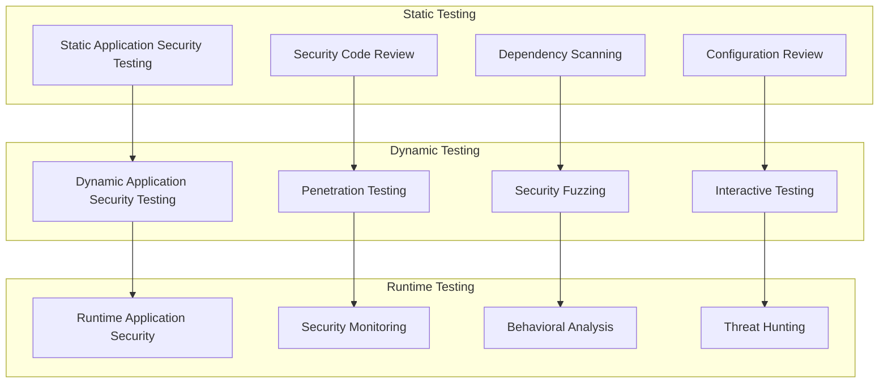

### 2. Security Test Automation
- **Automated vulnerability scanning**
- **Security regression testing**
- **Compliance verification**
- **Performance impact assessment**