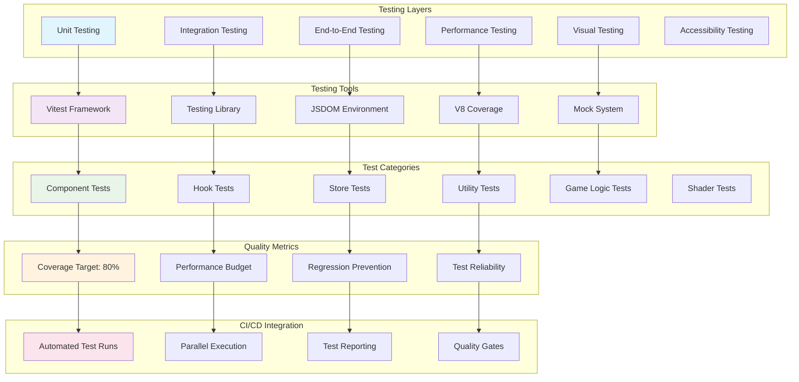
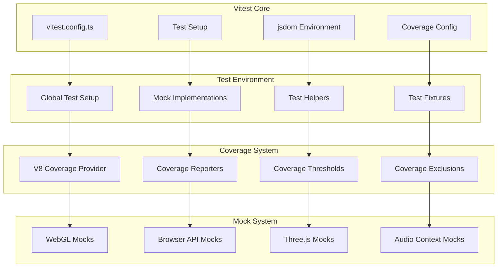
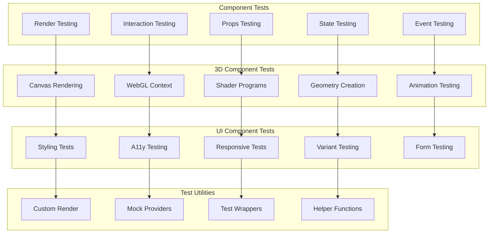
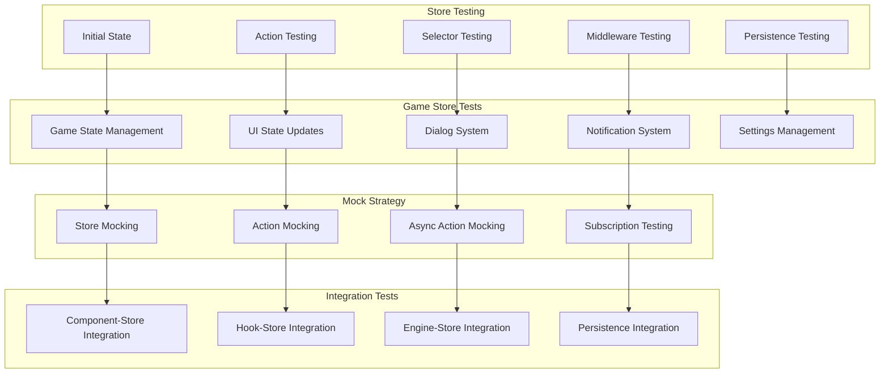
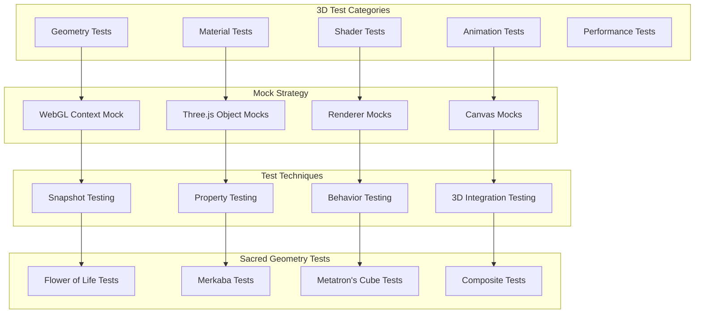
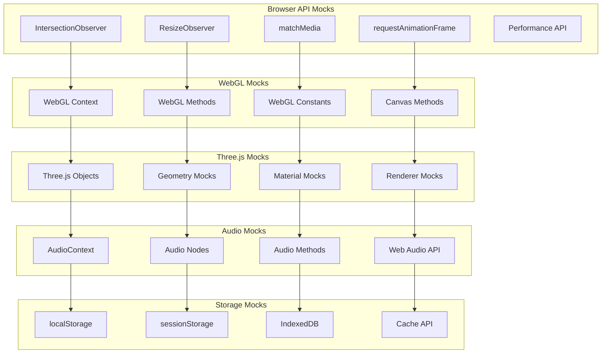
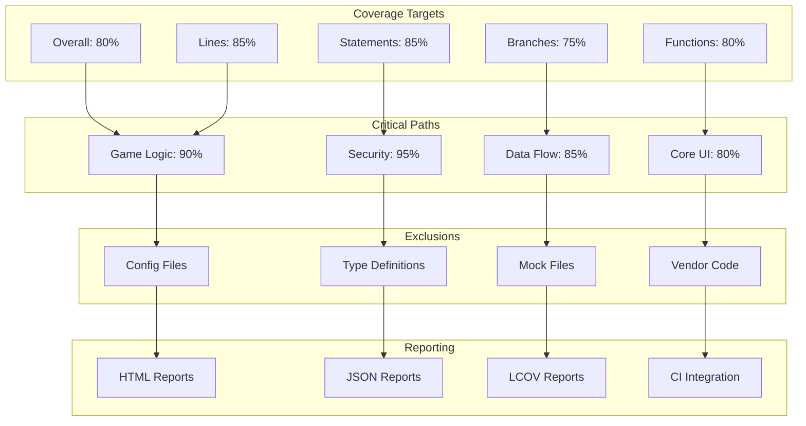
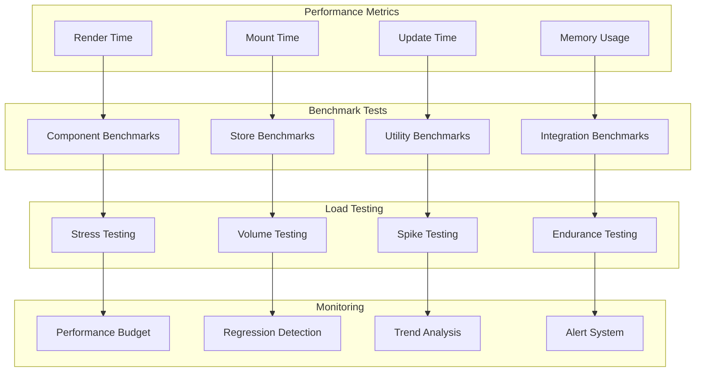
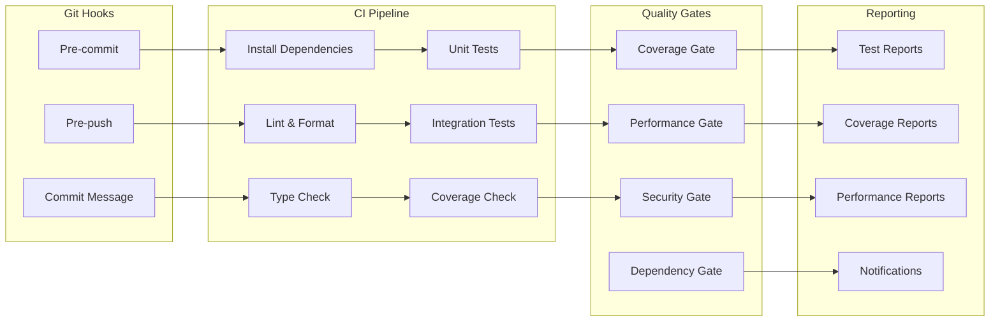

# Testing Architecture

## Testing Strategy Overview



## Test Framework Architecture

### 1. Vitest Configuration


### 2. Test Setup Architecture
```typescript
// Test Setup Configuration
interface TestSetupConfig {
  environment: 'jsdom' | 'node' | 'happy-dom'
  globals: boolean
  setupFiles: string[]
  coverage: {
    provider: 'v8' | 'c8'
    reporter: Array<'text' | 'json' | 'html' | 'lcov'>
    threshold: {
      statements: number
      branches: number
      functions: number
      lines: number
    }
    exclude: string[]
  }
  mocks: {
    webgl: boolean
    browserAPIs: boolean
    threeJs: boolean
    audioContext: boolean
  }
}
```

## Component Testing Strategy

### 1. Component Test Architecture


### 2. Test Patterns Implementation
```typescript
// Component Test Pattern
describe('Button Component', () => {
  // Render Testing
  test('renders with default props', () => {
    render(<Button>Click me</Button>)
    expect(screen.getByRole('button')).toBeInTheDocument()
  })

  // Variant Testing
  test.each([
    ['primary', 'from-blue-500'],
    ['secondary', 'from-purple-500'],
    ['ghost', 'bg-transparent']
  ])('renders %s variant correctly', (variant, expectedClass) => {
    render(<Button variant={variant}>Test</Button>)
    expect(screen.getByRole('button')).toHaveClass(expectedClass)
  })

  // Interaction Testing
  test('handles click events', async () => {
    const handleClick = vi.fn()
    render(<Button onClick={handleClick}>Click</Button>)

    await user.click(screen.getByRole('button'))
    expect(handleClick).toHaveBeenCalledTimes(1)
  })

  // State Testing
  test('manages loading state', () => {
    render(<Button loading>Loading</Button>)

    const button = screen.getByRole('button')
    expect(button).toBeDisabled()
    expect(button).toHaveClass('opacity-50')
  })
})
```

## Store Testing Architecture

### 1. Zustand Store Testing


### 2. Store Test Implementation
```typescript
// Store Testing Pattern
describe('GameStore', () => {
  let store: ReturnType<typeof useGameStore>

  beforeEach(() => {
    // Reset store state before each test
    store = useGameStore.getState()
    useGameStore.setState({
      isInitialized: false,
      isRunning: false,
      showHUD: true,
      notifications: []
    })
  })

  describe('Initial State', () => {
    test('has correct initial values', () => {
      const state = useGameStore.getState()
      expect(state.isInitialized).toBe(false)
      expect(state.isRunning).toBe(false)
      expect(state.showHUD).toBe(true)
    })
  })

  describe('Actions', () => {
    test('toggleHUD updates showHUD state', () => {
      const { toggleHUD } = useGameStore.getState()

      toggleHUD()
      expect(useGameStore.getState().showHUD).toBe(false)

      toggleHUD()
      expect(useGameStore.getState().showHUD).toBe(true)
    })

    test('addNotification adds to notifications array', () => {
      const { addNotification } = useGameStore.getState()

      addNotification({
        type: 'success',
        title: 'Test',
        message: 'Test message'
      })

      const notifications = useGameStore.getState().notifications
      expect(notifications).toHaveLength(1)
      expect(notifications[0].title).toBe('Test')
    })
  })

  describe('Selectors', () => {
    test('useGameUI selector returns UI state', () => {
      const { result } = renderHook(() => useGameUI())

      expect(result.current).toMatchObject({
        showHUD: true,
        showMenu: false,
        showInventory: false
      })
    })
  })
})
```

## 3D Testing Strategy

### 1. Three.js Component Testing


### 2. 3D Component Test Example
```typescript
// 3D Component Testing
describe('SacredGeometry Components', () => {
  beforeEach(() => {
    // Setup WebGL context mock
    vi.clearAllMocks()
  })

  describe('FlowerOfLife', () => {
    test('creates correct geometry structure', () => {
      render(
        <Canvas>
          <FlowerOfLife scale={1} color="#8b5cf6" />
        </Canvas>
      )

      // Test that component renders without crashing
      expect(true).toBe(true) // WebGL mock prevents actual rendering
    })

    test('applies scale transformation correctly', () => {
      const TestScene = () => {
        const meshRef = useRef()

        useEffect(() => {
          if (meshRef.current) {
            // Test scale application
            expect(meshRef.current.scale.x).toBeCloseTo(2)
          }
        }, [])

        return <FlowerOfLife ref={meshRef} scale={2} />
      }

      render(<Canvas><TestScene /></Canvas>)
    })
  })

  describe('Shader Materials', () => {
    test('creates projection shader material', () => {
      const mockTexture = new THREE.Texture()
      const projectorPosition = new THREE.Vector3(0, 5, 10)
      const projectorDirection = new THREE.Vector3(0, -1, 0)

      const material = createProjectionMaterial(
        mockTexture,
        projectorPosition,
        projectorDirection
      )

      expect(material).toBeInstanceOf(THREE.ShaderMaterial)
      expect(material.uniforms.projectorPosition.value).toEqual(projectorPosition)
    })
  })
})
```

## Mock Architecture

### 1. Comprehensive Mock System


### 2. Mock Implementation Strategy
```typescript
// WebGL Mock Implementation
class MockWebGLRenderingContext {
  canvas = createCanvas(800, 600)
  drawingBufferWidth = 800
  drawingBufferHeight = 600

  // Shader methods
  createShader = vi.fn()
  shaderSource = vi.fn()
  compileShader = vi.fn()
  createProgram = vi.fn()

  // Buffer methods
  createBuffer = vi.fn()
  bindBuffer = vi.fn()
  bufferData = vi.fn()

  // Texture methods
  createTexture = vi.fn()
  bindTexture = vi.fn()
  texImage2D = vi.fn()

  // Uniform methods
  getUniformLocation = vi.fn()
  uniform1f = vi.fn()
  uniformMatrix4fv = vi.fn()

  // Constants
  VERTEX_SHADER = 35633
  FRAGMENT_SHADER = 35632
  TRIANGLES = 4
  DEPTH_TEST = 2929
}

// Three.js Component Mock
vi.mock('@react-three/fiber', () => ({
  Canvas: ({ children }: { children: React.ReactNode }) => (
    <div data-testid="canvas-mock">{children}</div>
  ),
  useFrame: vi.fn(),
  useThree: vi.fn(() => ({
    scene: {},
    camera: {},
    gl: new MockWebGLRenderingContext()
  }))
}))
```

## Test Coverage Strategy

### 1. Coverage Requirements


### 2. Coverage Analysis
```typescript
// Coverage Configuration
export default defineConfig({
  test: {
    coverage: {
      provider: 'v8',
      reporter: ['text', 'json', 'html', 'lcov'],
      threshold: {
        statements: 85,
        branches: 75,
        functions: 80,
        lines: 85
      },
      exclude: [
        'node_modules/',
        'src/test/',
        '*.config.ts',
        '**/*.d.ts',
        'dist/',
        'src/assets/',
        'src/mocks/',
        'vite-plugins/'
      ],
      include: [
        'src/**/*.{ts,tsx}',
        '!src/**/*.stories.{ts,tsx}',
        '!src/**/*.test.{ts,tsx}'
      ]
    }
  }
})
```

## Performance Testing

### 1. Performance Test Architecture


### 2. Performance Test Implementation
```typescript
// Performance Testing Example
describe('Component Performance', () => {
  test('Button renders within performance budget', async () => {
    const startTime = performance.now()

    render(<Button>Performance Test</Button>)

    const endTime = performance.now()
    const renderTime = endTime - startTime

    // Assert render time is under budget (5ms)
    expect(renderTime).toBeLessThan(5)
  })

  test('Store update performance', async () => {
    const iterations = 1000
    const startTime = performance.now()

    for (let i = 0; i < iterations; i++) {
      useGameStore.getState().addNotification({
        type: 'info',
        title: `Test ${i}`,
        message: `Message ${i}`
      })
    }

    const endTime = performance.now()
    const avgTime = (endTime - startTime) / iterations

    // Assert average update time is under 1ms
    expect(avgTime).toBeLessThan(1)
  })
})
```

## CI/CD Integration

### 1. Test Pipeline Architecture


### 2. Test Automation Configuration
```yaml
# GitHub Actions Test Workflow
name: Test Suite

on:
  push:
    branches: [main, develop]
  pull_request:
    branches: [main]

jobs:
  test:
    runs-on: ubuntu-latest

    strategy:
      matrix:
        node-version: [18, 20]

    steps:
      - uses: actions/checkout@v3

      - name: Setup Node.js
        uses: actions/setup-node@v3
        with:
          node-version: ${{ matrix.node-version }}
          cache: 'npm'

      - name: Install dependencies
        run: npm ci

      - name: Type check
        run: npm run type-check

      - name: Lint
        run: npm run lint

      - name: Run tests
        run: npm run test:coverage

      - name: Upload coverage
        uses: codecov/codecov-action@v3
        with:
          file: ./coverage/lcov.info
```

## Test Utilities & Helpers

### 1. Custom Test Utilities
```typescript
// Test Utilities
export const renderWithProviders = (
  ui: React.ReactElement,
  options?: {
    initialGameState?: Partial<GameState>
    wrapperProps?: any
  }
) => {
  const { initialGameState, wrapperProps } = options || {}

  const Wrapper = ({ children }: { children: React.ReactNode }) => (
    <MonitoringProvider {...wrapperProps}>
      <ErrorBoundary>
        {children}
      </ErrorBoundary>
    </MonitoringProvider>
  )

  return render(ui, { wrapper: Wrapper })
}

export const createMockCanvas = () => ({
  getContext: vi.fn().mockReturnValue(new MockWebGLRenderingContext()),
  width: 800,
  height: 600,
  addEventListener: vi.fn(),
  removeEventListener: vi.fn()
})

export const waitForThreeJS = async () => {
  // Wait for Three.js components to initialize
  await new Promise(resolve => setTimeout(resolve, 100))
}
```

### 2. Test Data Factories
```typescript
// Test Data Factory
export const createMockGameState = (overrides?: Partial<GameState>): GameState => ({
  isInitialized: true,
  isRunning: false,
  isPaused: false,
  currentScene: 'test-scene',
  showHUD: true,
  showMenu: false,
  notifications: [],
  vjCareerGame: {
    isActive: false,
    player: {
      level: 1,
      experience: 0,
      money: 100,
      reputation: 0
    },
    scene: null
  },
  ...overrides
})

export const createMockNotification = (
  overrides?: Partial<NotificationData>
): NotificationData => ({
  id: `test-${Date.now()}`,
  type: 'info',
  title: 'Test Notification',
  message: 'Test message',
  timestamp: Date.now(),
  ...overrides
})
```

## Quality Assurance Metrics

### 1. Test Quality Metrics
- **Test Coverage**: Minimum 80% overall coverage
- **Test Reliability**: < 1% flaky test rate
- **Test Performance**: Tests complete within 5 minutes
- **Regression Prevention**: All critical paths tested

### 2. Continuous Improvement
- Regular test review and refactoring
- Performance benchmark monitoring
- Coverage gap analysis
- Test automation expansion