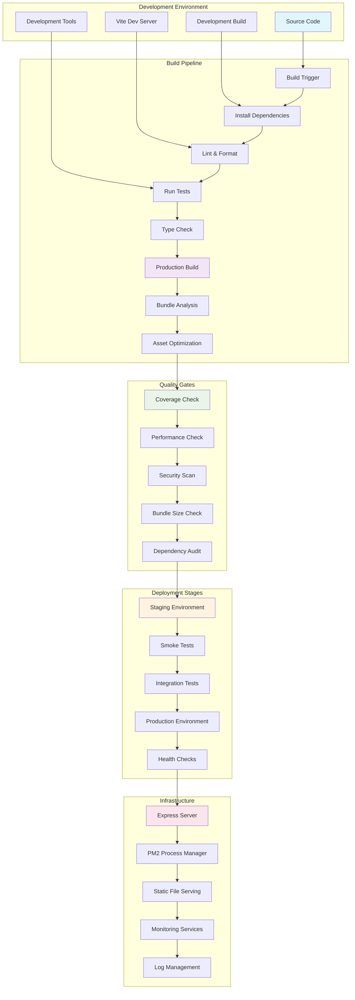
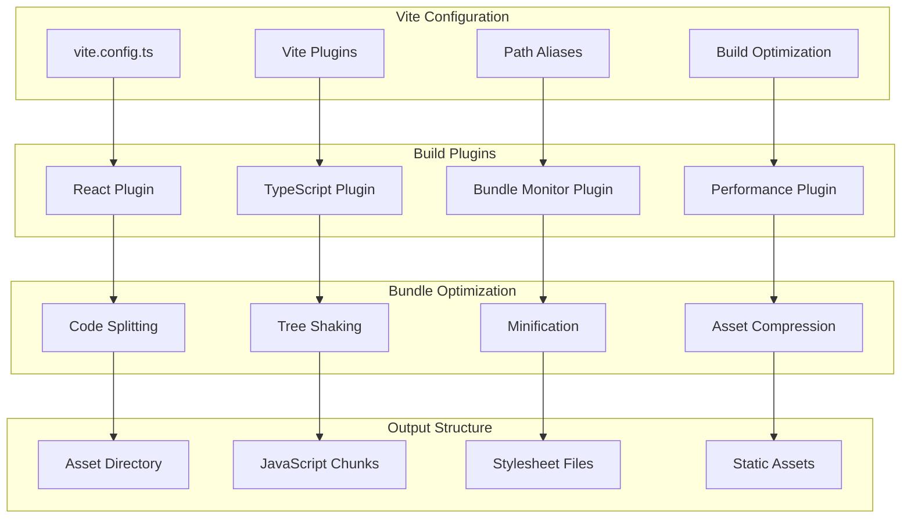
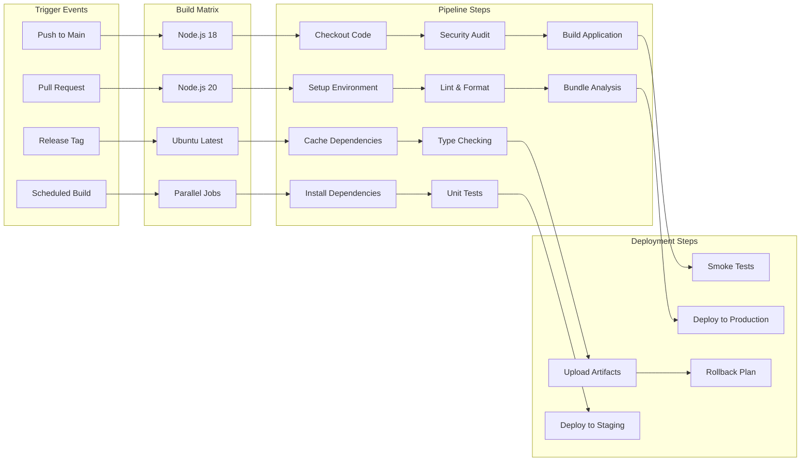
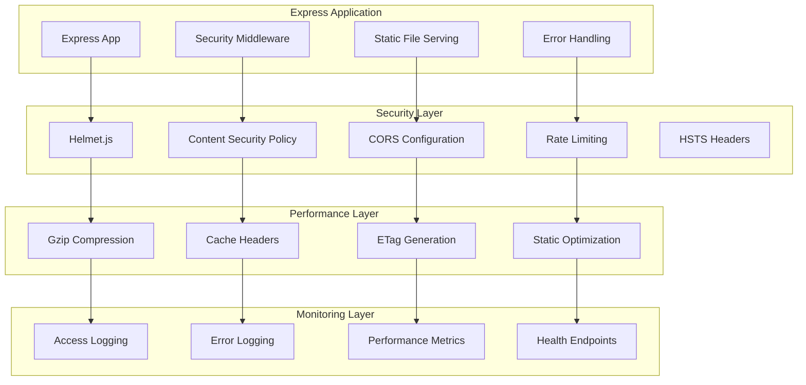
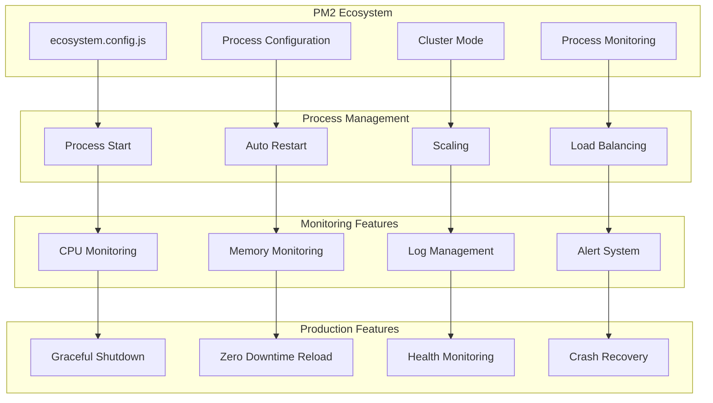
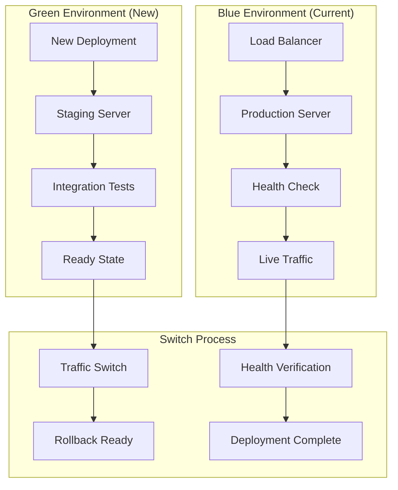
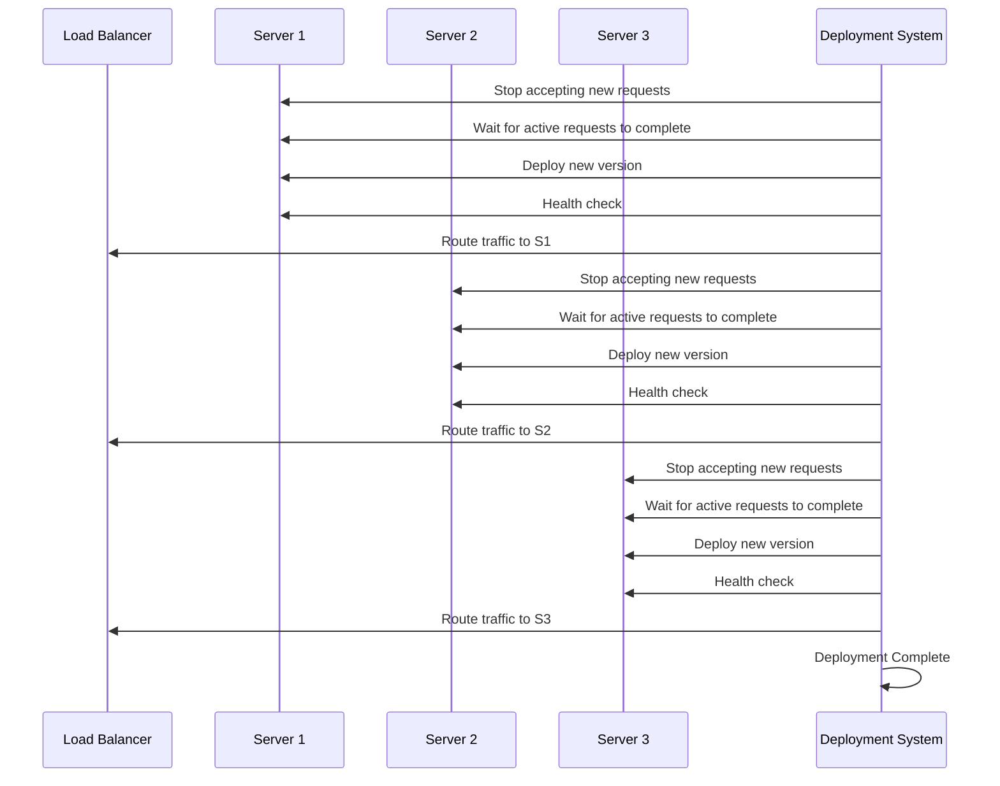
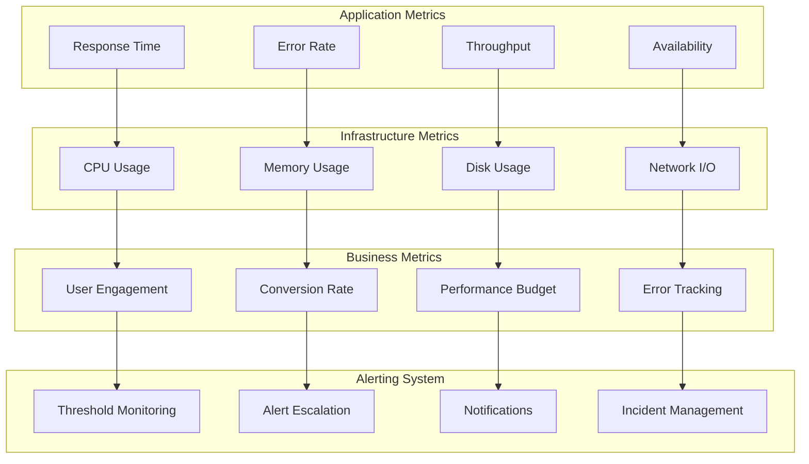

# Deployment Architecture

## Deployment Pipeline Overview



## Build System Architecture

### 1. Vite Build Configuration


### 2. Build Output Structure
```
dist/
├── assets/
│   ├── index-[hash].js           # Main application bundle
│   ├── vendor-react-[hash].js    # React vendor bundle
│   ├── three-core-[hash].js      # Three.js core bundle
│   ├── three-fiber-[hash].js     # React Three Fiber bundle
│   ├── ui-animation-[hash].js    # Animation libraries bundle
│   ├── state-[hash].js          # State management bundle
│   ├── routing-[hash].js        # Router bundle
│   ├── icons-[hash].js          # Icon bundle
│   └── styles-[hash].css        # Compiled stylesheets
├── index.html                   # Main HTML entry point
└── favicon.ico                  # Application favicon
```

## CI/CD Pipeline Architecture

### 1. GitHub Actions Workflow


### 2. GitHub Actions Configuration
```yaml
name: Build and Deploy

on:
  push:
    branches: [main]
  pull_request:
    branches: [main]
  release:
    types: [published]

jobs:
  build:
    runs-on: ubuntu-latest
    strategy:
      matrix:
        node-version: [18, 20]

    steps:
      - name: Checkout repository
        uses: actions/checkout@v4

      - name: Setup Node.js ${{ matrix.node-version }}
        uses: actions/setup-node@v4
        with:
          node-version: ${{ matrix.node-version }}
          cache: 'npm'

      - name: Install dependencies
        run: npm ci

      - name: Security audit
        run: npm audit --audit-level=moderate

      - name: Lint and format
        run: |
          npm run lint
          npm run lint:fix

      - name: Type checking
        run: npx tsc --noEmit

      - name: Run tests with coverage
        run: npm run test:coverage

      - name: Build application
        run: npm run build

      - name: Bundle analysis
        run: npm run build:analyze

      - name: Upload build artifacts
        uses: actions/upload-artifact@v4
        with:
          name: dist-${{ matrix.node-version }}
          path: dist/

  deploy:
    needs: build
    runs-on: ubuntu-latest
    if: github.ref == 'refs/heads/main'

    steps:
      - name: Download build artifacts
        uses: actions/download-artifact@v4
        with:
          name: dist-20

      - name: Deploy to staging
        run: |
          # Deployment commands
          echo "Deploying to staging environment"

      - name: Run smoke tests
        run: |
          # Smoke test commands
          echo "Running smoke tests"

      - name: Deploy to production
        if: success()
        run: |
          # Production deployment commands
          echo "Deploying to production"
```

## Production Environment

### 1. Express Server Configuration


### 2. Express Server Implementation
```javascript
// Production Express Server
const express = require('express');
const helmet = require('helmet');
const compression = require('compression');
const rateLimit = require('express-rate-limit');
const path = require('path');

const app = express();
const PORT = process.env.PORT || 8175;

// Security middleware
app.use(helmet({
  contentSecurityPolicy: {
    directives: {
      defaultSrc: ["'self'"],
      scriptSrc: ["'self'", "'unsafe-inline'", "https://cdn.jsdelivr.net"],
      styleSrc: ["'self'", "'unsafe-inline'", "https://fonts.googleapis.com"],
      imgSrc: ["'self'", "data:", "blob:", "https:"],
      connectSrc: ["'self'", "wss:"],
      fontSrc: ["'self'", "https://fonts.gstatic.com"],
      objectSrc: ["'none'"],
      frameSrc: ["'none'"]
    }
  },
  hsts: {
    maxAge: 31536000,
    includeSubDomains: true,
    preload: true
  }
}));

// Performance middleware
app.use(compression());

// Rate limiting
const limiter = rateLimit({
  windowMs: 15 * 60 * 1000, // 15 minutes
  max: 100, // limit each IP to 100 requests per windowMs
  message: 'Too many requests from this IP'
});
app.use(limiter);

// Static file serving with caching
app.use(express.static(path.join(__dirname, 'dist'), {
  maxAge: '1y',
  etag: true,
  lastModified: true,
  setHeaders: (res, filePath) => {
    if (filePath.endsWith('.html')) {
      res.set('Cache-Control', 'no-cache');
    }
  }
}));

// Health check endpoint
app.get('/health', (req, res) => {
  res.status(200).json({
    status: 'healthy',
    timestamp: new Date().toISOString(),
    uptime: process.uptime(),
    memory: process.memoryUsage()
  });
});

// SPA fallback
app.get('*', (req, res) => {
  res.sendFile(path.join(__dirname, 'dist', 'index.html'));
});

// Error handling
app.use((err, req, res, next) => {
  console.error(err.stack);
  res.status(500).json({ error: 'Something went wrong!' });
});

app.listen(PORT, () => {
  console.log(`Server running on port ${PORT}`);
});
```

## Process Management with PM2

### 1. PM2 Configuration


### 2. PM2 Ecosystem Configuration
```javascript
// ecosystem.config.js
module.exports = {
  apps: [{
    name: 'lightbrush-website',
    script: 'server.js',
    cwd: '/home/server/lightbrush-website',
    instances: 'max', // Use all CPU cores
    exec_mode: 'cluster',
    autorestart: true,
    watch: false,
    max_memory_restart: '1G',
    env: {
      NODE_ENV: 'production',
      PORT: 8175
    },
    env_staging: {
      NODE_ENV: 'staging',
      PORT: 8176
    },
    error_file: './logs/err.log',
    out_file: './logs/out.log',
    log_file: './logs/combined.log',
    time: true,
    merge_logs: true,
    log_date_format: 'YYYY-MM-DD HH:mm:ss Z',
    min_uptime: '10s',
    max_restarts: 10,
    kill_timeout: 5000,
    listen_timeout: 8000,
    shutdown_with_message: true
  }]
};
```

## Deployment Strategies

### 1. Blue-Green Deployment


### 2. Rolling Deployment


## Monitoring and Observability

### 1. Production Monitoring


### 2. Health Check Implementation
```javascript
// Health Check Endpoint
app.get('/health', (req, res) => {
  const healthCheck = {
    status: 'healthy',
    timestamp: new Date().toISOString(),
    uptime: process.uptime(),
    memory: process.memoryUsage(),
    loadavg: os.loadavg(),
    version: process.env.npm_package_version || 'unknown',
    environment: process.env.NODE_ENV || 'development',
    checks: {
      server: 'healthy',
      memory: process.memoryUsage().heapUsed < 500 * 1024 * 1024 ? 'healthy' : 'warning',
      disk: 'healthy', // Add disk space check
      database: 'healthy' // Add database connectivity check if applicable
    }
  };

  const isHealthy = Object.values(healthCheck.checks)
    .every(status => status === 'healthy');

  res.status(isHealthy ? 200 : 503).json(healthCheck);
});

// Readiness check for Kubernetes/Docker
app.get('/ready', (req, res) => {
  // Check if application is ready to serve traffic
  const isReady = true; // Add your readiness logic
  res.status(isReady ? 200 : 503).json({ ready: isReady });
});
```

## Security in Production

### 1. Production Security Measures
- **HTTPS Enforcement**: SSL/TLS certificates with automatic renewal
- **Security Headers**: Comprehensive security headers via Helmet.js
- **Rate Limiting**: Request rate limiting to prevent abuse
- **Input Validation**: Server-side input validation and sanitization
- **Error Handling**: Secure error responses that don't leak sensitive information

### 2. Infrastructure Security
- **Firewall Configuration**: Proper network firewall rules
- **Access Control**: Limited SSH access with key-based authentication
- **Regular Updates**: Automated security updates for system packages
- **Backup Strategy**: Regular encrypted backups with tested restore procedures

## Performance Optimization

### 1. Production Optimizations
- **Asset Compression**: Gzip compression for all static assets
- **CDN Integration**: Content delivery network for global performance
- **Cache Strategy**: Aggressive caching with proper cache invalidation
- **Bundle Optimization**: Code splitting and tree shaking for minimal bundle sizes

### 2. Monitoring and Alerts
- **Performance Budgets**: Automated alerts for performance regressions
- **Error Tracking**: Real-time error monitoring and alerting
- **Uptime Monitoring**: Continuous availability monitoring
- **Resource Utilization**: CPU, memory, and disk usage monitoring

## Disaster Recovery

### 1. Backup Strategy
- **Automated Backups**: Daily automated backups of critical data
- **Multiple Locations**: Geographically distributed backup storage
- **Tested Restoration**: Regular restoration testing procedures
- **Version Control**: Source code backup through Git repositories

### 2. Incident Response
- **Monitoring Alerts**: Automated alerting for critical issues
- **Escalation Procedures**: Clear escalation paths for different severity levels
- **Communication Plan**: Status page and communication protocols
- **Post-Mortem Process**: Learning from incidents to prevent recurrence