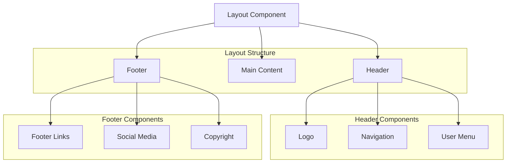
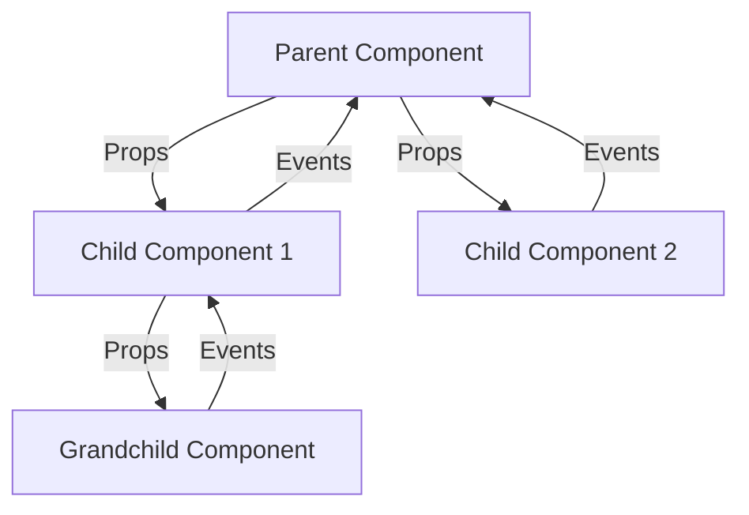

# Component Architecture

This document details the component architecture of the LightBrush Website project, including component organization, hierarchy, patterns, and best practices.

## Table of Contents

- [Component Hierarchy](#component-hierarchy)
- [Component Categories](#component-categories)
- [Component Patterns](#component-patterns)
- [Data Flow Patterns](#data-flow-patterns)
- [Composition Strategies](#composition-strategies)
- [Performance Patterns](#performance-patterns)

---

## Component Hierarchy

The component architecture follows a hierarchical structure with clear separation of concerns and responsibilities.

```mermaid
graph TB
    App[App]

    subgraph "Route Level Components"
        HomePage[HomePage]
        GamePage[GamePage]
        SimulatorPage[SimulatorPage]
        PortfolioPage[PortfolioPage]
    end

    subgraph "Layout Components"
        Layout[Layout]
        Header[Header]
        Footer[Footer]
        Navigation[Navigation]
    end

    subgraph "Feature Components"
        InteractiveHero3D[InteractiveHero3D]
        ProjectionSimulator[ProjectionSimulator]
        VJCareerGame3D[VJCareerGame3D]
        ProjectShowcase3D[ProjectShowcase3D]
    end

    subgraph "UI Components"
        Button[Button]
        Modal[Modal]
        LoadingScreen[LoadingScreen]
        NotificationSystem[NotificationSystem]
    end

    subgraph "3D Components"
        Scene3D[Scene3D]
        FloatingOrb[FloatingOrb]
        ParticleField[ParticleField]
        ProjectionEffect[ProjectionEffect]
    end

    subgraph "Provider Components"
        GameProvider[GameProvider]
        PerformanceProvider[PerformanceProvider]
        ThemeProvider[ThemeProvider]
    end

    App --> Layout
    App --> Provider Components
    Layout --> Header
    Layout --> Footer
    Layout --> "Route Level Components"

    HomePage --> Feature Components
    GamePage --> Feature Components
    SimulatorPage --> Feature Components
    PortfolioPage --> Feature Components

    "Feature Components" --> "3D Components"
    "Feature Components" --> "UI Components"
    "3D Components" --> "UI Components"
```

---

## Component Categories

### 1. Application Level Components

#### App Component
The root component that sets up providers, routing, and global error boundaries.

```typescript
// src/App.tsx
function App() {
  return (
    <ErrorBoundary>
      <PerformanceProvider>
        <GameProvider>
          <Router>
            <Layout>
              <Routes>
                <Route path="/" element={<HomePage />} />
                <Route path="/game" element={<GamePage />} />
                <Route path="/simulator" element={<SimulatorPage />} />
                <Route path="/portfolio" element={<PortfolioPage />} />
              </Routes>
            </Layout>
          </Router>
        </GameProvider>
      </PerformanceProvider>
    </ErrorBoundary>
  );
}
```

### 2. Layout Components

#### Layout System
Provides consistent page structure and navigation.



#### Component Structure
```typescript
// src/components/layout/Layout.tsx
interface LayoutProps {
  children: React.ReactNode;
  showHeader?: boolean;
  showFooter?: boolean;
  className?: string;
}

function Layout({ children, showHeader = true, showFooter = true, className }: LayoutProps) {
  return (
    <div className={`min-h-screen flex flex-col ${className}`}>
      {showHeader && <Header />}
      <main className="flex-1">
        {children}
      </main>
      {showFooter && <Footer />}
    </div>
  );
}
```

### 3. Feature Components

#### InteractiveHero3D Architecture
Complex 3D hero section with multiple sub-components.

```mermaid
graph TB
    InteractiveHero3D[InteractiveHero3D]

    subgraph "3D Scene Components"
        Scene3D[Scene3D]
        Camera[PerspectiveCamera]
        Lighting[Lighting System]
        Controls[OrbitControls]
    end

    subgraph "3D Objects"
        FloatingOrb[FloatingOrb × 7]
        ParticleField[ParticleField]
        ProjectionEffect[ProjectionEffect]
        Text3D[3D Text]
    end

    subgraph "Effects"
        Stars[Stars]
        Sparkles[Sparkles]
        PostProcessing[Post Processing]
    end

    subgraph "UI Overlay"
        Gradients[Background Gradients]
        Content[Content Overlay]
        ScrollIndicator[Scroll Indicator]
    end

    InteractiveHero3D --> Scene3D
    Scene3D --> Camera
    Scene3D --> Lighting
    Scene3D --> Controls
    Scene3D --> "3D Objects"
    Scene3D --> Effects

    InteractiveHero3D --> "UI Overlay"
```

#### Component Implementation
```typescript
// src/components/3d/InteractiveHero3D.tsx
function InteractiveHero3D() {
  return (
    <div className="w-full h-screen relative overflow-hidden">
      <Canvas
        gl={{ alpha: true, antialias: true, powerPreference: 'high-performance' }}
        shadows
      >
        <Scene3D />
      </Canvas>

      {/* UI Overlays */}
      <GradientOverlay />
      <ContentOverlay />
      <ScrollIndicator />
    </div>
  );
}

function Scene3D() {
  const orbPositions = useMemo(() => generateOrbPositions(), []);
  const orbColors = ['#3b82f6', '#8b5cf6', '#ec4899', /* ... */];

  return (
    <>
      <PerspectiveCamera makeDefault position={[0, 5, 15]} fov={50} />
      <LightingSystem />

      <Suspense fallback={null}>
        <EnvironmentalEffects />
        <FloatingOrbs positions={orbPositions} colors={orbColors} />
        <ProjectionEffect />
        <HeroText />
      </Suspense>

      <OrbitControls {...controlsConfig} />
    </>
  );
}
```

### 4. UI Components

#### Component Design System
Reusable UI components with consistent design patterns.

```mermaid
graph TB
    UIComponents[UI Components]

    subgraph "Form Components"
        Button[Button]
        Input[Input]
        Select[Select]
        Checkbox[Checkbox]
    end

    subgraph "Feedback Components"
        LoadingScreen[LoadingScreen]
        Toast[Toast]
        Modal[Modal]
        Tooltip[Tooltip]
    end

    subgraph "Display Components"
        Card[Card]
        Badge[Badge]
        Progress[Progress]
        Avatar[Avatar]
    end

    subgraph "Navigation Components"
        Tabs[Tabs]
        Breadcrumb[Breadcrumb]
        Pagination[Pagination]
        Menu[Menu]
    end

    UIComponents --> "Form Components"
    UIComponents --> "Feedback Components"
    UIComponents --> "Display Components"
    UIComponents --> "Navigation Components"
```

#### Button Component Example
```typescript
// src/components/ui/Button.tsx
interface ButtonProps extends React.ButtonHTMLAttributes<HTMLButtonElement> {
  variant?: 'primary' | 'secondary' | 'outline' | 'ghost';
  size?: 'sm' | 'md' | 'lg';
  loading?: boolean;
  icon?: React.ReactNode;
  iconPosition?: 'left' | 'right';
  fullWidth?: boolean;
}

const Button = forwardRef<HTMLButtonElement, ButtonProps>(({
  variant = 'primary',
  size = 'md',
  loading = false,
  icon,
  iconPosition = 'left',
  fullWidth = false,
  children,
  className,
  disabled,
  ...props
}, ref) => {
  const baseStyles = 'inline-flex items-center justify-center font-medium transition-colors focus:outline-none focus:ring-2 focus:ring-offset-2';

  const variantStyles = {
    primary: 'bg-blue-600 text-white hover:bg-blue-700 focus:ring-blue-500',
    secondary: 'bg-gray-600 text-white hover:bg-gray-700 focus:ring-gray-500',
    outline: 'border border-gray-300 text-gray-700 hover:bg-gray-50 focus:ring-blue-500',
    ghost: 'text-gray-700 hover:bg-gray-100 focus:ring-gray-500'
  };

  const sizeStyles = {
    sm: 'px-3 py-1.5 text-sm rounded',
    md: 'px-4 py-2 text-base rounded-md',
    lg: 'px-6 py-3 text-lg rounded-lg'
  };

  const classes = cn(
    baseStyles,
    variantStyles[variant],
    sizeStyles[size],
    fullWidth && 'w-full',
    (disabled || loading) && 'opacity-50 cursor-not-allowed',
    className
  );

  return (
    <button
      ref={ref}
      className={classes}
      disabled={disabled || loading}
      {...props}
    >
      {loading && <LoadingSpinner className="mr-2 h-4 w-4" />}
      {!loading && icon && iconPosition === 'left' && <span className="mr-2">{icon}</span>}
      {children}
      {!loading && icon && iconPosition === 'right' && <span className="ml-2">{icon}</span>}
    </button>
  );
});
```

### 5. Game Components

#### Game UI Architecture
Specialized components for game interface and mechanics.

```mermaid
graph TB
    GameComponents[Game Components]

    subgraph "HUD Components"
        GameHUD[Game HUD]
        PlayerStats[Player Stats]
        MiniMap[Mini Map]
        ObjectiveTracker[Objective Tracker]
    end

    subgraph "Dialog System"
        DialogBox[Dialog Box]
        CharacterPortrait[Character Portrait]
        DialogOptions[Dialog Options]
        TypewriterText[Typewriter Text]
    end

    subgraph "Menu Systems"
        GameMenu[Game Menu]
        Inventory[Inventory]
        SkillTree[Skill Tree]
        Settings[Settings]
    end

    subgraph "3D Game World"
        VJCareerGame3D[VJ Career Game 3D]
        VenueEnvironment[Venue Environment]
        ProjectionDisplay[Projection Display]
        AudienceSystem[Audience System]
    end

    GameComponents --> "HUD Components"
    GameComponents --> "Dialog System"
    GameComponents --> "Menu Systems"
    GameComponents --> "3D Game World"
```

#### Game HUD Component
```typescript
// src/components/game/GameHUD.tsx
interface GameHUDProps {
  visible?: boolean;
  player?: Player;
  onMenuClick?: () => void;
  onInventoryClick?: () => void;
}

function GameHUD({ visible = true, player, onMenuClick, onInventoryClick }: GameHUDProps) {
  if (!visible || !player) return null;

  return (
    <div className="fixed inset-0 pointer-events-none z-50">
      {/* Top Bar */}
      <div className="absolute top-4 left-4 right-4 flex justify-between pointer-events-auto">
        <PlayerStats player={player} />
        <GameControls onMenuClick={onMenuClick} />
      </div>

      {/* Bottom Bar */}
      <div className="absolute bottom-4 left-4 right-4 flex justify-between pointer-events-auto">
        <QuickActions />
        <InventoryButton onClick={onInventoryClick} />
      </div>

      {/* Side Panels */}
      <ObjectivePanel />
      <NotificationPanel />
    </div>
  );
}
```

---

## Component Patterns

### 1. Compound Component Pattern

Used for complex components with multiple related parts.

```typescript
// Modal compound component
const Modal = {
  Root: ModalRoot,
  Trigger: ModalTrigger,
  Content: ModalContent,
  Header: ModalHeader,
  Body: ModalBody,
  Footer: ModalFooter,
  Close: ModalClose
};

// Usage
function GameMenu() {
  return (
    <Modal.Root>
      <Modal.Trigger>Open Menu</Modal.Trigger>
      <Modal.Content>
        <Modal.Header>Game Menu</Modal.Header>
        <Modal.Body>
          <GameMenuContent />
        </Modal.Body>
        <Modal.Footer>
          <Modal.Close>Close</Modal.Close>
        </Modal.Footer>
      </Modal.Content>
    </Modal.Root>
  );
}
```

### 2. Render Props Pattern

For sharing component logic with flexible rendering.

```typescript
// Performance monitor with render props
interface PerformanceMonitorProps {
  children: (metrics: PerformanceMetrics) => React.ReactNode;
  updateInterval?: number;
}

function PerformanceMonitor({ children, updateInterval = 1000 }: PerformanceMonitorProps) {
  const metrics = usePerformanceMonitor({ updateInterval });
  return <>{children(metrics)}</>;
}

// Usage
function PerformanceDisplay() {
  return (
    <PerformanceMonitor>
      {(metrics) => (
        <div className="performance-stats">
          <div>FPS: {metrics.fps.toFixed(1)}</div>
          <div>Memory: {metrics.memoryUsage.toFixed(1)} MB</div>
        </div>
      )}
    </PerformanceMonitor>
  );
}
```

### 3. Higher-Order Component Pattern

For adding common functionality to components.

```typescript
// Performance tracking HOC
function withPerformanceTracking<P extends object>(
  Component: React.ComponentType<P>,
  trackingId: string
) {
  return function PerformanceTrackedComponent(props: P) {
    const { trackFrame } = usePerformanceMonitor();

    useFrame(() => {
      const startTime = performance.now();
      // Component will render
      requestAnimationFrame(() => {
        const renderTime = performance.now() - startTime;
        trackFrame(renderTime);
      });
    });

    return <Component {...props} />;
  };
}

// Usage
const TrackedInteractiveHero = withPerformanceTracking(InteractiveHero3D, 'hero-3d');
```

### 4. Custom Hook Pattern

Extracting component logic into reusable hooks.

```typescript
// Custom hook for 3D object management
function use3DObject<T extends THREE.Object3D>(
  factory: () => T,
  dependencies: any[] = []
) {
  const { getObject, releaseObject } = useResourcePool();
  const [object, setObject] = useState<T | null>(null);

  useEffect(() => {
    const obj = getObject(`custom-${Date.now()}`, factory);
    setObject(obj);

    return () => {
      if (obj) {
        releaseObject(obj);
      }
    };
  }, dependencies);

  return object;
}

// Usage in component
function CustomMesh() {
  const mesh = use3DObject(
    () => {
      const mesh = new THREE.Mesh();
      mesh.geometry = new THREE.BoxGeometry();
      mesh.material = new THREE.MeshStandardMaterial({ color: 'red' });
      return mesh;
    },
    [] // Dependencies
  );

  return mesh ? <primitive object={mesh} /> : null;
}
```

---

## Data Flow Patterns

### 1. Unidirectional Data Flow

Data flows down through props, events bubble up.



### 2. State Management Flow

Using Zustand for centralized state management.

```typescript
// State flow example
function GameInterface() {
  // Subscribe to specific state slices
  const { isRunning, isPaused } = useGameEngine();
  const { showHUD, showMenu } = useGameUI();
  const { notifications } = useGameNotifications();

  // Event handlers that dispatch actions
  const handlePauseGame = () => {
    if (isRunning && !isPaused) {
      pauseGame();
      showMenuModal();
    }
  };

  return (
    <div className="game-interface">
      {showHUD && <GameHUD />}
      {showMenu && <GameMenu />}
      <NotificationSystem notifications={notifications} />
    </div>
  );
}
```

### 3. Context-Based Data Flow

For deeply nested component trees.

```typescript
// Game context provider
const GameContext = createContext<GameContextValue | null>(null);

function GameProvider({ children }: { children: React.ReactNode }) {
  const gameState = useGameStore();
  const performanceMetrics = usePerformanceMonitor();

  const contextValue = useMemo(() => ({
    ...gameState,
    performanceMetrics
  }), [gameState, performanceMetrics]);

  return (
    <GameContext.Provider value={contextValue}>
      {children}
    </GameContext.Provider>
  );
}

// Context consumer hook
function useGameContext() {
  const context = useContext(GameContext);
  if (!context) {
    throw new Error('useGameContext must be used within GameProvider');
  }
  return context;
}
```

---

## Composition Strategies

### 1. Component Composition

Building complex UIs from simple, reusable components.

```typescript
// Flexible layout composition
function GameLayout({ children }: { children: React.ReactNode }) {
  return (
    <div className="game-layout">
      <Header variant="game" />
      <main className="game-content">
        {children}
      </main>
      <Footer variant="minimal" />
    </div>
  );
}

// Page composition
function GamePage() {
  return (
    <GameLayout>
      <GameCanvas />
      <GameUI />
      <PerformanceOverlay />
    </GameLayout>
  );
}
```

### 2. Slot-Based Composition

Allowing flexible content insertion.

```typescript
interface CardProps {
  children: React.ReactNode;
  header?: React.ReactNode;
  footer?: React.ReactNode;
  actions?: React.ReactNode;
  className?: string;
}

function Card({ children, header, footer, actions, className }: CardProps) {
  return (
    <div className={`card ${className}`}>
      {header && <div className="card-header">{header}</div>}
      <div className="card-body">{children}</div>
      {actions && <div className="card-actions">{actions}</div>}
      {footer && <div className="card-footer">{footer}</div>}
    </div>
  );
}

// Usage
function ProjectCard({ project }: { project: Project }) {
  return (
    <Card
      header={<h3>{project.title}</h3>}
      footer={<div>Created: {project.createdAt}</div>}
      actions={
        <>
          <Button variant="outline">Edit</Button>
          <Button variant="primary">View</Button>
        </>
      }
    >
      <p>{project.description}</p>
      
    </Card>
  );
}
```

### 3. Provider Composition

Layering multiple providers for different concerns.

```typescript
function App() {
  return (
    <ErrorBoundary>
      <ThemeProvider>
        <PerformanceProvider>
          <GameProvider>
            <Router>
              <QueryProvider>
                <AppContent />
              </QueryProvider>
            </Router>
          </GameProvider>
        </PerformanceProvider>
      </ThemeProvider>
    </ErrorBoundary>
  );
}
```

---

## Performance Patterns

### 1. Memoization Patterns

Preventing unnecessary re-renders with React.memo and useMemo.

```typescript
// Memoized 3D component
const MemoizedFloatingOrb = memo(FloatingOrb, (prevProps, nextProps) => {
  return (
    prevProps.position.equals(nextProps.position) &&
    prevProps.color === nextProps.color &&
    prevProps.scale === nextProps.scale
  );
});

// Memoized computed values
function ParticleSystem({ count, spread }: { count: number; spread: number }) {
  const particles = useMemo(() => {
    return generateParticles(count, spread);
  }, [count, spread]);

  const particleGeometry = useMemo(() => {
    const geometry = new THREE.BufferGeometry();
    geometry.setAttribute('position', new THREE.Float32BufferAttribute(particles, 3));
    return geometry;
  }, [particles]);

  return (
    <points geometry={particleGeometry}>
      <pointsMaterial size={0.1} />
    </points>
  );
}
```

### 2. Lazy Loading Patterns

Loading components and resources on demand.

```typescript
// Lazy loaded route components
const HomePage = lazy(() => import('../pages/HomePage'));
const GamePage = lazy(() => import('../pages/GamePage'));
const SimulatorPage = lazy(() => import('../pages/SimulatorPage'));

function AppRoutes() {
  return (
    <Suspense fallback={<LoadingScreen />}>
      <Routes>
        <Route path="/" element={<HomePage />} />
        <Route path="/game" element={<GamePage />} />
        <Route path="/simulator" element={<SimulatorPage />} />
      </Routes>
    </Suspense>
  );
}

// Lazy loaded 3D models
function LazyModel({ modelUrl }: { modelUrl: string }) {
  return (
    <Suspense fallback={<PlaceholderMesh />}>
      <Model url={modelUrl} />
    </Suspense>
  );
}
```

### 3. Virtualization Patterns

Efficiently rendering large lists of components.

```typescript
// Virtual list for large datasets
function VirtualizedProjectList({ projects }: { projects: Project[] }) {
  const [visibleRange, setVisibleRange] = useState({ start: 0, end: 10 });

  const visibleProjects = useMemo(() => {
    return projects.slice(visibleRange.start, visibleRange.end);
  }, [projects, visibleRange]);

  return (
    <div className="project-list">
      {visibleProjects.map(project => (
        <ProjectCard key={project.id} project={project} />
      ))}
    </div>
  );
}
```

This component architecture provides a scalable, maintainable foundation for the LightBrush Website, enabling complex 3D interactions while maintaining excellent performance and developer experience.