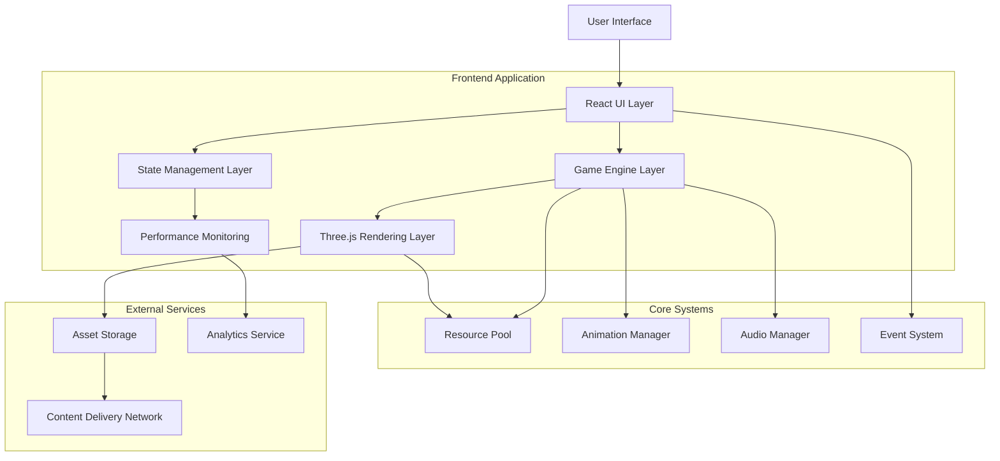
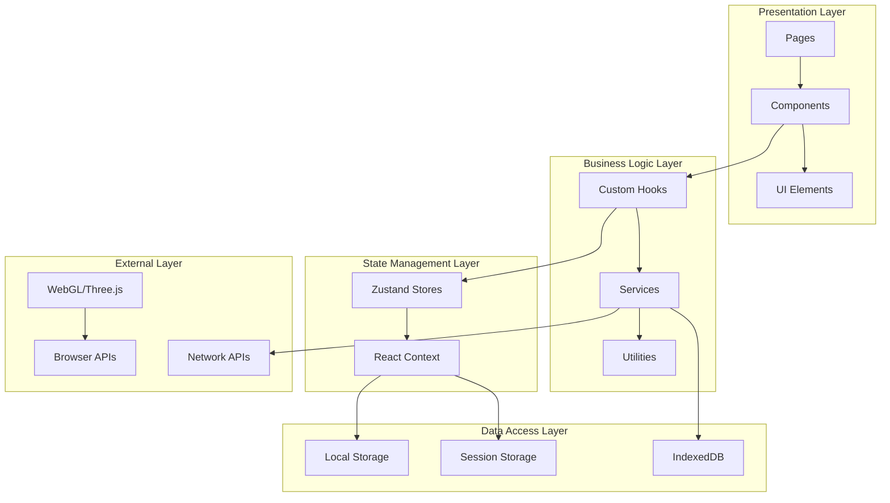
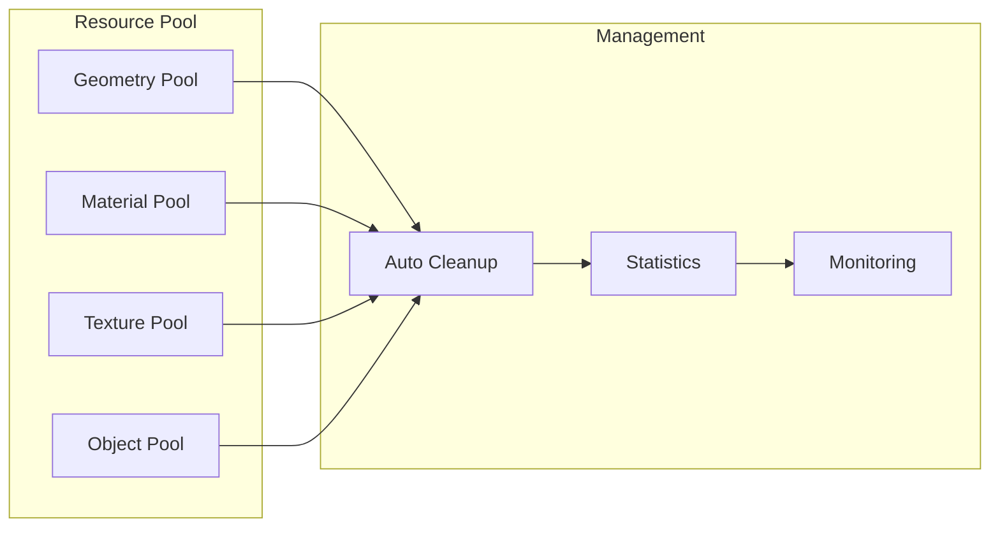
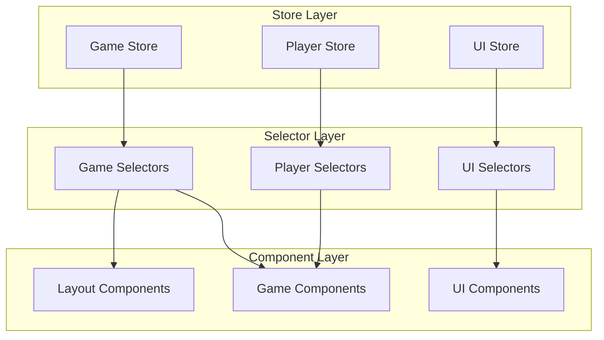
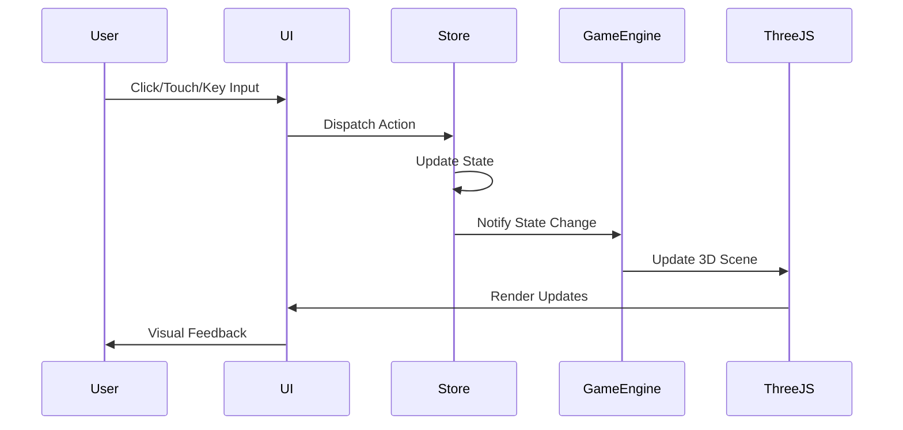
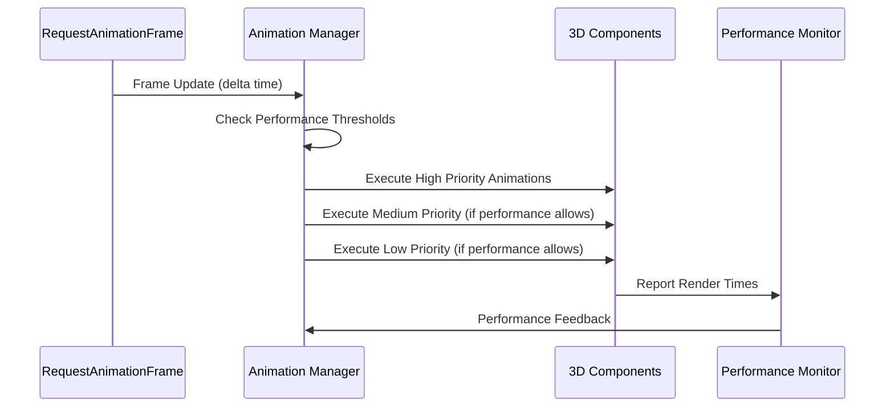
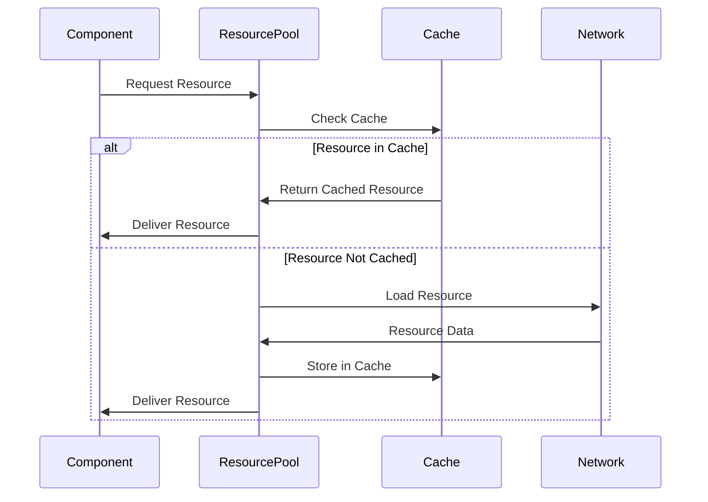
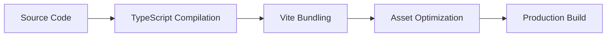

# System Architecture Overview

This document provides a comprehensive overview of the LightBrush Website system architecture, including technology stack, architectural patterns, and system design principles.

## Table of Contents

- [High-Level Architecture](#high-level-architecture)
- [Technology Stack](#technology-stack)
- [Architectural Patterns](#architectural-patterns)
- [System Components](#system-components)
- [Data Flow](#data-flow)
- [Performance Architecture](#performance-architecture)
- [Security Architecture](#security-architecture)

---

## High-Level Architecture

The LightBrush Website is built as a modern single-page application (SPA) with advanced 3D capabilities, real-time performance monitoring, and sophisticated state management.



## Technology Stack

### Frontend Framework
- **React 19.1.1**: Modern React with concurrent features
- **TypeScript 5.8.3**: Type-safe development
- **Vite 7.1.7**: Fast build tool and development server

### 3D Graphics & Animation
- **Three.js 0.180.0**: 3D graphics library
- **React Three Fiber 9.3.0**: React renderer for Three.js
- **React Three Drei 10.7.6**: Useful helpers and abstractions
- **React Spring Three 10.0.3**: Spring-physics animations for 3D

### State Management
- **Zustand 5.0.8**: Lightweight state management
- **Subscriptions Middleware**: Fine-grained reactivity

### Styling & UI
- **Tailwind CSS 4.1.13**: Utility-first CSS framework
- **Framer Motion 12.23.22**: Animation library
- **PostCSS**: CSS post-processing

### Development & Testing
- **Vitest 3.2.4**: Fast unit testing
- **Testing Library**: React component testing
- **ESLint**: Code linting
- **Husky**: Git hooks

### Performance & Monitoring
- **Custom Performance Monitor**: Real-time metrics
- **Resource Pool System**: Memory optimization
- **Animation Manager**: Frame rate optimization

---

## Architectural Patterns

### 1. Component-Based Architecture

The application follows a strict component-based architecture with clear separation of concerns:

```
src/
├── components/           # Reusable UI components
│   ├── 3d/              # Three.js components
│   ├── ui/              # UI components
│   ├── game/            # Game-specific components
│   ├── simulator/       # Projection mapping components
│   └── layout/          # Layout components
├── hooks/               # Custom React hooks
├── store/               # State management
├── utils/               # Utility functions
└── services/            # External service integrations
```

### 2. Layered Architecture



### 3. Event-Driven Architecture

The system uses an event-driven approach for loose coupling between components:

- **Game Events**: Player actions, state changes, achievements
- **Performance Events**: Frame rate changes, memory warnings
- **UI Events**: Modal state, navigation, user interactions
- **System Events**: Loading states, error conditions

### 4. Observer Pattern

Implemented through Zustand's subscription system for reactive state management:

```typescript
// State subscription example
useGameStore.subscribe(
  (state) => state.settings.graphics.quality,
  (quality) => {
    // React to quality changes
    adjustRendererQuality(quality);
  }
);
```

---

## System Components

### 1. Frontend Application Layer

#### React UI Layer
- **Pages**: Route-level components (Home, Game, Simulator, Portfolio)
- **Components**: Reusable UI building blocks
- **Layout**: Header, Footer, Navigation components
- **Forms**: Input handling and validation

#### Game Engine Layer
- **Game Engine**: Core game logic and state management
- **Scene Management**: 3D scene organization and switching
- **Entity System**: Game object management
- **Physics Integration**: Basic physics calculations

#### Three.js Rendering Layer
- **Render Pipeline**: Optimized rendering workflow
- **Scene Graph**: Hierarchical 3D object organization
- **Material System**: Shader and material management
- **Animation System**: 3D animations and transitions

### 2. Core Systems

#### Resource Pool System


**Features:**
- Automatic memory management
- Object pooling for performance
- Statistics tracking
- Configurable cleanup policies

#### Animation Manager
- **Priority-based execution**: Critical, High, Medium, Low priorities
- **Performance adaptive**: Automatically adjusts based on FPS
- **Centralized control**: Single point for all animations
- **Resource efficient**: Prevents duplicate animation loops

#### Performance Monitor
- **Real-time metrics**: FPS, memory usage, render time
- **Automatic optimization**: Quality adjustment based on performance
- **Alert system**: Performance warnings and notifications
- **Historical tracking**: Performance trends over time

### 3. State Management Architecture



#### Store Design Principles
- **Single Source of Truth**: Each domain has one primary store
- **Immutable Updates**: All state changes are immutable
- **Optimistic Updates**: UI updates immediately, sync later
- **Persistence**: Automatic save/load for user preferences

---

## Data Flow

### 1. User Interaction Flow



### 2. Animation Frame Flow



### 3. Resource Loading Flow



---

## Performance Architecture

### 1. Rendering Optimization

#### Level of Detail (LOD) System
- **Distance-based**: Higher detail for closer objects
- **Performance-based**: Reduce quality under load
- **Automatic switching**: Seamless quality transitions

#### Frustum Culling
- **View-based culling**: Only render visible objects
- **Occlusion culling**: Skip objects behind others
- **Dynamic batching**: Combine similar objects

#### Instanced Rendering
- **Geometry instancing**: Reuse geometry for multiple objects
- **Material instancing**: Share materials across instances
- **Transform optimization**: Efficient matrix calculations

### 2. Memory Optimization

#### Object Pooling
- **Geometry pools**: Reuse common shapes
- **Material pools**: Share material instances
- **Texture pools**: Cache and reuse textures
- **Object pools**: Recycle 3D objects

#### Garbage Collection Management
- **Explicit disposal**: Manual cleanup of Three.js objects
- **Reference management**: Prevent memory leaks
- **Weak references**: Allow garbage collection when appropriate

### 3. Animation Optimization

#### Priority-Based Execution
```typescript
enum AnimationPriority {
  CRITICAL = 0,    // UI elements, essential interactions
  HIGH = 1,        // Primary content, hero animations
  MEDIUM = 2,      // Secondary effects, transitions
  LOW = 3,         // Ambient effects, particles
}
```

#### Adaptive Quality
- **Performance monitoring**: Real-time FPS tracking
- **Quality scaling**: Automatic detail reduction
- **Emergency mode**: Disable non-critical animations

---

## Security Architecture

### 1. Client-Side Security

#### Input Validation
- **Type checking**: TypeScript compile-time validation
- **Runtime validation**: Parameter checking in functions
- **Sanitization**: Clean user inputs for display

#### XSS Prevention
- **Content Security Policy**: Restrict script execution
- **DOM sanitization**: Clean HTML content
- **Safe rendering**: Use React's built-in protection

### 2. Asset Security

#### Content Integrity
- **Subresource Integrity**: Verify asset authenticity
- **HTTPS enforcement**: Secure asset delivery
- **Domain validation**: Restrict asset sources

#### Error Handling
- **Graceful degradation**: Fallback for failed loads
- **Error boundaries**: Contain component failures
- **Logging**: Track errors without exposing internals

### 3. Performance Security

#### Resource Limits
- **Memory limits**: Prevent excessive usage
- **Animation limits**: Control frame rate impact
- **Request throttling**: Limit API calls

#### DoS Protection
- **Rate limiting**: Control user interactions
- **Resource pooling**: Prevent memory exhaustion
- **Automatic cleanup**: Regular resource management

---

## Deployment Architecture

### 1. Build Process



### 2. Asset Pipeline

- **Code Splitting**: Lazy-loaded route components
- **Asset Optimization**: Compressed images and models
- **Caching Strategy**: Long-term caching with versioning
- **CDN Integration**: Global asset delivery

### 3. Performance Monitoring

- **Real User Monitoring**: Track actual user performance
- **Error Tracking**: Monitor and alert on errors
- **Performance Budgets**: Enforce size and speed limits
- **Analytics Integration**: User behavior tracking

---

## Scalability Considerations

### 1. Component Scalability

- **Lazy Loading**: Load components on demand
- **Code Splitting**: Separate bundles for different features
- **Tree Shaking**: Remove unused code
- **Dynamic Imports**: Runtime module loading

### 2. Performance Scalability

- **Adaptive Quality**: Scale based on device capabilities
- **Progressive Enhancement**: Basic functionality first
- **Resource Pooling**: Efficient memory usage
- **Debounced Updates**: Prevent excessive re-renders

### 3. Maintenance Scalability

- **Modular Architecture**: Independent component updates
- **TypeScript**: Catch errors at compile time
- **Testing Strategy**: Automated test coverage
- **Documentation**: Comprehensive API documentation

This system architecture provides a robust foundation for the LightBrush Website, ensuring high performance, maintainability, and scalability while delivering an exceptional user experience.